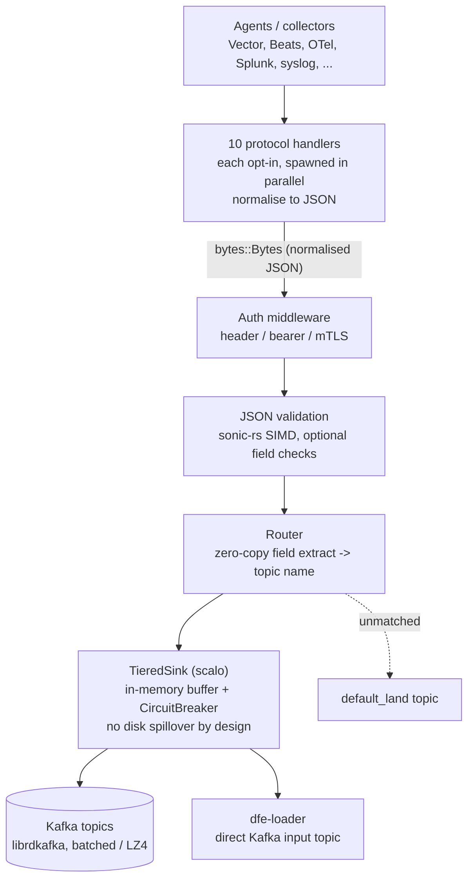

# dfe-receiver

[](https://github.com/hyperi-io/dfe-receiver/actions)
[](https://github.com/hyperi-io/dfe-receiver/blob/main/LICENSE)

> Agents speak ten different protocols and none of them speak yours. dfe-receiver
> terminates all of them at one door, normalises to JSON, and hands the result to
> Kafka or straight to the loader.

High-performance HTTP/gRPC receiver for PB/s scale data ingestion.

## Overview

dfe-receiver is a native Rust data ingestion service that accepts data from multiple
agent protocols, normalises it to JSON, and routes it to Kafka topics or dfe-loader.
It is built on the [scalo](https://github.com/hyperi-io/scalo-rs) data-plane runtime
(config cascade, logging, metrics, transport, TieredSink, health probes).

**10 protocol handlers** (HTTP, gRPC, OTLP, Lumberjack/Beats, Splunk HEC,
Syslog, Fluent Forward, GELF, Prometheus Remote Write, Flow [NetFlow + sFlow
-- **EXPERIMENTAL**]).

**Supported protocols:**

| Protocol | Port | Source |
|---|---|---|
| HTTP(S) JSON | configurable | Vector, custom agents |
| gRPC Vector sink | configurable | Vector |
| OTLP gRPC | 4317 | OpenTelemetry collectors |
| OTLP HTTP | 4318 | OpenTelemetry collectors |
| Lumberjack/Beats | 5044 | Filebeat, Logstash Beats output |
| Splunk HEC | 8088 | Splunk forwarders, Fluentd HEC output |
| Syslog UDP/TCP/TLS | 514 / 6514 | syslogd, rsyslog, syslog-ng |
| Fluent Forward | 24224 | Fluentd, Fluent Bit |
| GELF TCP | 12201 | Graylog GELF output, Fluent Bit |
| Prometheus Remote Write | 9091 | Prometheus, VictoriaMetrics |
| Flow (NetFlow + sFlow) -- **EXPERIMENTAL** | 2055 / 4739 / 6343 UDP | NetFlow v5/v9, IPFIX, sFlow v5 exporters (v7 not supported) |

**Core behaviour:**

- Normalises all protocol data to JSON
- Validates JSON format and optional required fields
- Routes to Kafka topics based on configurable field extraction rules
- Buffers in-memory with backpressure via CircuitBreaker (no disk spillover by design)
- Supports header auth, bearer tokens, and mTLS authentication

## Quick Start

### Build prerequisites

`protoc` must be on `PATH`. The gRPC, OTLP and Prometheus Remote Write
protocols compile vendored `.proto` files at build time, and so does `scalo` --
without it the build fails inside a dependency's build script rather than
anywhere that names the missing package.

```bash
# Debian / Ubuntu
sudo apt-get install -y protobuf-compiler

# macOS
brew install protobuf

protoc --version
```

`cmake` and a C toolchain are also needed: `aws-lc-sys` (rustls' crypto
backend) and `rdkafka-sys` both build native code from source.

```bash
# Build
cargo build --release

# Run with config file
./target/release/dfe-receiver --config config.yaml

# Run with environment override
DFE_RECEIVER_SERVER__BIND_ADDRESS=0.0.0.0:8080 ./target/release/dfe-receiver
```

## Configuration

See [config.example.yaml](https://github.com/hyperi-io/dfe-receiver/blob/main/config.example.yaml) for full configuration reference.

### Minimal Configuration

```yaml
server:
  bind_address: "0.0.0.0:8080"
  auth:
    mode: none

kafka:
  brokers:
    - "localhost:9092"

routing:
  default_source: "default"
  topic_suffix: "_land"
```

### Authentication Modes

#### Header Authentication

```yaml
server:
  auth:
    mode: header
    accepted_headers:
      - name: x-api-key
        values: ["secret-key-1", "secret-key-2"]
```

#### Bearer Token Authentication

Static tokens (development):

```yaml
server:
  auth:
    mode: bearer
    bearer:
      tokens:
        - "dev-token-1"
        - "dev-token-2"
```

Dynamic tokens from secret manager (production):

```yaml
server:
  auth:
    mode: bearer
    bearer:
      secret_source: "vault:secret/data/auth:bearer_tokens"
      refresh_interval_secs: 300
```

Supported secret sources:

- `file:/path/to/tokens` - Local file (K8s secrets)
- `vault:secret/path:key` - OpenBao/Vault
- `aws:secret-name:key` - AWS Secrets Manager

#### mTLS Authentication

```yaml
server:
  tls:
    enabled: true
    cert_file: /etc/ssl/server.crt
    key_file: /etc/ssl/server.key
    ca_file: /etc/ssl/ca.crt
    client_auth: required
  auth:
    mode: mtls
```

## API Endpoints

### POST /ingest

Accepts JSON payloads for ingestion.

```bash
curl -X POST http://localhost:8080/ingest \
  -H "Content-Type: application/json" \
  -H "Authorization: Bearer <YOUR_TOKEN>" \
  -d '{"event_type": "login", "user_id": "123"}'
```

**Response Codes:**

- `202 Accepted` - Message queued for delivery
- `400 Bad Request` - Invalid JSON or validation failure
- `401 Unauthorized` - Authentication failed
- `503 Service Unavailable` - Downstream unavailable or under pressure

### GET /livez

Kubernetes liveness probe.

```bash
curl http://localhost:8080/livez
# OK
```

### GET /readyz

Kubernetes readiness probe. Returns 503 if downstream sinks are unavailable.

```bash
curl http://localhost:8080/readyz
```

## Routing

Messages are routed to Kafka topics based on source rules that extract JSON fields:

```yaml
routing:
  default_source: "default"
  topic_suffix: "_land"
  source_rules:
    - name: "auth_events"
      mode: "key_value_set"
      field: "event.category"
      values: ["auth", "authentication"]
      topic: "logs_auth"
  dlq:
    enabled: true
    topic: "dlq_land"
```

Given `{"event": {"category": "auth"}}`, routes to `logs_auth_land`.
Unmatched messages route to `default_land` (default_source + topic_suffix).

## Metrics

Prometheus metrics available at the configured metrics endpoint:

```yaml
metrics:
  address: "0.0.0.0:9090"
```

Key metrics:

- `receiver_requests_total` - Total requests received
- `receiver_bytes_received_total` - Total bytes ingested
- `receiver_messages_sent_kafka_total` - Messages sent to Kafka
- `receiver_scaling_pressure` - Scaling pressure for autoscaling (0-100)

## Architecture

Every protocol handler normalises to JSON, then all share one core pipeline.
The handlers run in parallel (each opt-in); the table above lists the full set.



## Development

```bash
# Run tests
cargo nextest run

# Run with debug logging
RUST_LOG=debug cargo run -- --config config.yaml

# Run integration tests (requires Kafka)
docker compose -f docker-compose.test.yaml up -d
cargo test --test integration_kafka -- --ignored
docker compose -f docker-compose.test.yaml down -v
```

### Working with Kafka

[kcat](https://github.com/edenhill/kcat) (formerly kafkacat) is the essential
CLI tool for inspecting Kafka topics during development.

```bash
# Start local Kafka (KRaft, no Zookeeper)
docker compose -f docker-compose.test.yaml up -d

# List all topics and broker info
kcat -b localhost:9092 -L

# Consume all messages from a topic (Ctrl+C to stop)
kcat -b localhost:9092 -t events -C

# Consume with metadata (partition, offset, timestamp)
kcat -b localhost:9092 -t events -C -f 'P:%p O:%o T:%T\n%s\n'

# Tail a topic - watch live as dfe-receiver routes messages
kcat -b localhost:9092 -t events -C -o end

# Send a test event through dfe-receiver and verify it arrives
curl -s -X POST http://localhost:8080/ingest \
  -H 'Content-Type: application/json' \
  -d '{"level":"info","message":"kcat test event"}'

kcat -b localhost:9092 -t events -C -c 1  # consume exactly 1 message

# Produce directly to Kafka (bypass dfe-receiver, useful for consumer testing)
echo '{"level":"warn","message":"direct kafka test"}' | \
  kcat -b localhost:9092 -t events -P

# Count messages in a topic
kcat -b localhost:9092 -t events -C -e -q | wc -l

# Optional: open Kafbat UI in browser (start with --profile ui)
docker compose -f docker-compose.test.yaml --profile ui up -d
open http://localhost:8080
```

> **Install kcat:** `apt install kcat` / `brew install kcat`
> On older systems it may be packaged as `kafkacat`.

## License

This project is licensed under the Business Source License 1.1 (BUSL-1.1). See [LICENSE](https://github.com/hyperi-io/dfe-receiver/blob/main/LICENSE) for details.

Copyright (c) 2026 HYPERI PTY LIMITED

For commercial licensing options, see [COMMERCIAL.md](https://github.com/hyperi-io/dfe-receiver/blob/main/COMMERCIAL.md).
