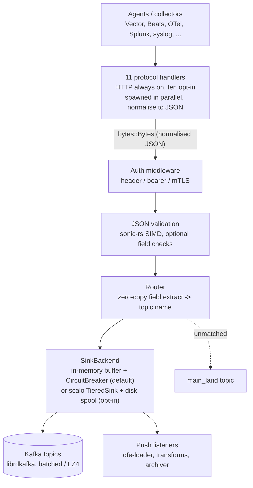

# dfe-receiver

[](https://github.com/hyperi-io/dfe-receiver/actions)
[](https://github.com/hyperi-io/dfe-receiver/blob/main/LICENSE)

> Agents speak ten different protocols and none of them speak yours. dfe-receiver
> terminates all of them at one door, normalises to JSON, and hands the result to
> Kafka or straight to the loader.

High-performance HTTP/gRPC receiver for PB/s scale data ingestion.

## Overview

dfe-receiver is a native Rust data ingestion service that accepts data from multiple
agent protocols, normalises it to JSON, and routes it to Kafka topics or dfe-loader.
It is built on the [scalo](https://github.com/hyperi-io/scalo-rs) data-plane runtime
(config cascade, logging, metrics, transport, TieredSink, health probes).

**11 protocol handlers** (HTTP, gRPC, OTLP, Lumberjack/Beats, Splunk HEC,
Syslog, Fluent Forward, GELF, Prometheus Remote Write, Webhook, Flow [NetFlow
+ sFlow -- **EXPERIMENTAL**]).

**Supported protocols:**

| Protocol | Port | Source |
|---|---|---|
| HTTP(S) JSON | configurable | Vector, custom agents |
| gRPC Vector sink | configurable | Vector |
| Webhook (`POST /webhook/{caller}`) | shares HTTP, or 8090 | Product alert rules and notification hooks (runZero, ...) |
| OTLP gRPC | 4317 | OpenTelemetry collectors |
| OTLP HTTP | 4318 | OpenTelemetry collectors |
| Lumberjack/Beats | 5044 | Filebeat, Logstash Beats output |
| Splunk HEC | 8088 | Splunk forwarders, Fluentd HEC output |
| Syslog UDP/TCP/TLS | 514 / 6514 | syslogd, rsyslog, syslog-ng |
| Fluent Forward | 24224 | Fluentd, Fluent Bit |
| GELF TCP | 12201 | Graylog GELF output, Fluent Bit |
| Prometheus Remote Write | 9091 | Prometheus, VictoriaMetrics |
| Flow (NetFlow + sFlow) -- **EXPERIMENTAL** | 2055 / 4739 / 6343 UDP | NetFlow v5/v9, IPFIX, sFlow v5 exporters (v7 not supported) |

**Core behaviour:**

- Normalises all protocol data to JSON
- Validates JSON format and optional required fields
- Routes to Kafka topics based on configurable field extraction rules
- Buffers in-memory with backpressure via CircuitBreaker by default; disk spillover is opt-in (`buffer.spillover.enabled`)
- Supports header auth, bearer tokens, and mTLS authentication

## Quick Start

### Build prerequisites

`protoc` must be on `PATH`. The gRPC, OTLP and Prometheus Remote Write
protocols compile vendored `.proto` files at build time, and so does `scalo` --
without it the build fails inside a dependency's build script rather than
anywhere that names the missing package.

```bash
# Debian / Ubuntu
sudo apt-get install -y protobuf-compiler

# macOS
brew install protobuf

protoc --version
```

`cmake` and a C toolchain are also needed: `aws-lc-sys` (rustls' crypto
backend) and `rdkafka-sys` both build native code from source.

```bash
# Build
cargo build --release

# Run with config file
./target/release/dfe-receiver --config config.yaml

# Run with environment override
DFE_RECEIVER_SERVER__BIND_ADDRESS=0.0.0.0:8080 ./target/release/dfe-receiver
```

## Configuration

See [config.example.yaml](https://github.com/hyperi-io/dfe-receiver/blob/main/config.example.yaml) for full configuration reference.

### Minimal Configuration

```yaml
server:
  bind_address: "0.0.0.0:8080"
  auth:
    mode: none

kafka:
  brokers:
    - "localhost:9092"

routing:
  default_source: "main"
  topic_suffix: "_land"
```

### Authentication Modes

#### Header Authentication

```yaml
server:
  auth:
    mode: header
    accepted_headers:
      - name: x-api-key
        values: ["secret-key-1", "secret-key-2"]
```

#### Bearer Token Authentication

Static tokens (development):

```yaml
server:
  auth:
    mode: bearer
    bearer:
      tokens:
        - "dev-token-1"
        - "dev-token-2"
```

Dynamic tokens from secret manager (production):

```yaml
server:
  auth:
    mode: bearer
    bearer:
      secret_source: "vault:secret/data/auth:bearer_tokens"
      refresh_interval_secs: 300
```

Supported secret sources, read through scalo's credential resolver:

- `file:/path/to/tokens` - Local file (K8s secrets)
- `vault:secret/path:key` - OpenBao/Vault, also spelled `bao:` or `openbao:`
- `env:VAR_NAME` - Environment variable

A `vault:` reference names the field to read, so the `:key` is not optional
there. AWS Secrets Manager is not built in: an `aws:` reference is refused at
startup naming the scalo feature it would need.

#### mTLS Authentication

```yaml
server:
  tls:
    enabled: true
    cert_file: /etc/ssl/server.crt
    key_file: /etc/ssl/server.key
    ca_file: /etc/ssl/ca.crt
    client_auth: required
  auth:
    mode: mtls
```

## API Endpoints

### POST /ingest

Accepts JSON payloads for ingestion.

```bash
curl -X POST http://localhost:8080/ingest \
  -H "Content-Type: application/json" \
  -H "Authorization: Bearer <YOUR_TOKEN>" \
  -d '{"event_type": "login", "user_id": "123"}'
```

**Response Codes:**

- `202 Accepted` - Message queued for delivery. While a destination is
  unreachable the receiver holds the record in memory and re-sends it when the
  destination returns
- `400 Bad Request` - Invalid JSON or validation failure
- `401 Unauthorized` - Authentication failed
- `503 Service Unavailable` with `Retry-After: 5` - Under memory pressure, or a
  destination has been unreachable long enough to fill the in-memory hold (the
  `buffer.pressure_threshold` share of `buffer.memory_limit`, or 1000 records
  when no limit is set), or the receiver cannot deliver the record for any
  other reason that is not the record's own fault. Re-send the request: events
  of a batched request accepted before the refusal then arrive twice, never
  zero times

Every listener follows the same rule in its own protocol: a record the
receiver could not take is never answered as accepted. The per-listener
answers are in [docs/DESIGN.md](docs/DESIGN.md#what-a-sender-is-told).

### POST /webhook/{caller}

A generic authenticated intake for products that push events: one route per
caller declared under `webhook.callers`, each with its own secret, topic and
body shape. Every accepted record lands on the caller's topic stamped with
`_source: <caller>` and `_timestamp_receiver`.

```yaml
webhook:
  enabled: true
  callers:
    - name: runzero                  # POST /webhook/runzero
      topic: runzero_alerts_land
      auth:
        mode: header                 # the product can only set static headers
        secret_source: "file:/run/secrets/runzero-webhook"
        header: x-webhook-secret
    - name: pager
      topic: pager_land
      auth:
        mode: hmac                   # HMAC-SHA256 over "{timestamp}.{body}"
        secret_source: "vault:kv/data/dfe/webhooks:pager"
        header: x-signature
        timestamp_header: x-timestamp
        tolerance_secs: 300
      body: array
      filter: 'severity == "high"'
```

`hmac` gives integrity and a replay window; `header` is for products that can
only attach fixed headers and is opt-in per caller. With `webhook.bind_address`
unset the routes share the HTTP listener without its `server.auth` middleware;
set it for an own listener. Secrets come from a `provider:path:key` reference,
never from the config file.

**Response Codes:**

- `202 Accepted` - Every record queued (a filtered-out record still answers 202)
- `400 Bad Request` - Body shape does not match the caller's `body` setting,
  or an array element is not an object (the whole request is refused and
  nothing is delivered), or validation refused a record for good
- `401 Unauthorized` - `{"error": "<reason>"}`: `missing_signature`,
  `invalid_signature`, `stale_signature`, `missing_auth_header`,
  `invalid_header_value`, ...
- `404 Not Found` - No caller by that name
- `413 Payload Too Large` - Over `webhook.max_body_size`
- `503 Service Unavailable` - A record could not be taken (pressure, a full
  hold, a destination down), with `retry-after`. Records of the same request
  taken before it arrive again on the retry

### GET /livez

Kubernetes liveness probe.

```bash
curl http://localhost:8080/livez
# OK
```

### GET /readyz

Kubernetes readiness probe. Returns 503 until every enabled listener has bound, again once any of them stops or fails (draining included), and under memory pressure. A listener that cannot bind holds it at 503 while the process stays up and logs `Protocol handler failed`. A destination outage does not fail it: every replica shares the outage, so failing the probe would empty the Service, and ingest refuses per request with 503 instead. The metrics port's `/readyz`, which the chart probes, gives the same answer.

```bash
curl http://localhost:8080/readyz
```

## Routing

Messages are routed to Kafka topics based on source rules that extract JSON fields:

```yaml
routing:
  default_source: "main"
  topic_suffix: "_land"
  source_rules:
    - name: "auth_events"
      mode: "key_value_set"
      field: "event.category"
      values: ["auth", "authentication"]
      topic: "logs_auth"
  dlq:
    enabled: true
    topic: "dfe_receiver_dlq"
```

Given `{"event": {"category": "auth"}}`, routes to `logs_auth_land`.
Unmatched messages route to `main_land` (default_source + topic_suffix).

## Metrics

Prometheus metrics available at the configured metrics endpoint:

```yaml
metrics:
  address: "0.0.0.0:9090"
```

Key metrics:

- `receiver_requests_total` - Total requests received
- `receiver_bytes_received_total` - Total bytes ingested
- `receiver_kafka_sends_total` - Messages librdkafka queued
- `receiver_kafka_delivered_total` - Messages a broker acknowledged
- `receiver_kafka_delivery_failures_total` - Messages no broker took, by reason
- `receiver_records_dropped_total` - Records dropped with no way to tell the
  sender (UDP syslog, a record refused on an acknowledgement-only protocol, a
  held record at shutdown), by transport and reason
- `receiver_scaling_pressure` - Scaling pressure for autoscaling (0-100)

## Architecture

Every protocol handler normalises to JSON, then all share one core pipeline.
The handlers run in parallel; HTTP always runs because the probes ride its
listener, and the other ten are opt-in. The table above lists the full set.



Design rationale and the invariants are in
[docs/architecture.md](docs/architecture.md).

## Development

```bash
# Run tests
cargo nextest run

# Run with debug logging
RUST_LOG=debug cargo run -- --config config.yaml

# Run the Kafka e2e tests (requires Docker; they are #[ignore] by default)
docker compose -f docker-compose.test.yaml up -d
cargo nextest run --test e2e --run-ignored all
docker compose -f docker-compose.test.yaml down -v
```

### Working with Kafka

[kcat](https://github.com/edenhill/kcat) (formerly kafkacat) is the essential
CLI tool for inspecting Kafka topics during development.

```bash
# Start local Kafka (KRaft, no Zookeeper)
docker compose -f docker-compose.test.yaml up -d

# List all topics and broker info
kcat -b localhost:9092 -L

# Consume all messages from a topic (Ctrl+C to stop)
kcat -b localhost:9092 -t events -C

# Consume with metadata (partition, offset, timestamp)
kcat -b localhost:9092 -t events -C -f 'P:%p O:%o T:%T\n%s\n'

# Tail a topic - watch live as dfe-receiver routes messages
kcat -b localhost:9092 -t events -C -o end

# Send a test event through dfe-receiver and verify it arrives
curl -s -X POST http://localhost:8080/ingest \
  -H 'Content-Type: application/json' \
  -d '{"level":"info","message":"kcat test event"}'

kcat -b localhost:9092 -t events -C -c 1  # consume exactly 1 message

# Produce directly to Kafka (bypass dfe-receiver, useful for consumer testing)
echo '{"level":"warn","message":"direct kafka test"}' | \
  kcat -b localhost:9092 -t events -P

# Count messages in a topic
kcat -b localhost:9092 -t events -C -e -q | wc -l

# Optional: open Kafbat UI in browser (start with --profile ui)
docker compose -f docker-compose.test.yaml --profile ui up -d
open http://localhost:8080
```

> **Install kcat:** `apt install kcat` / `brew install kcat`
> On older systems it may be packaged as `kafkacat`.

## License

This project is licensed under the Business Source License 1.1 (BUSL-1.1). See [LICENSE](https://github.com/hyperi-io/dfe-receiver/blob/main/LICENSE) for details.

Copyright (c) 2026 HYPERI PTY LIMITED

For commercial licensing options, see [COMMERCIAL.md](https://github.com/hyperi-io/dfe-receiver/blob/main/COMMERCIAL.md).

## Context

### What this is

The suite's one external door: eleven wire protocols terminated, every payload
normalised to JSON, stamped, routed to Kafka or straight to dfe-loader over
gRPC. It and dfe-ui are the only components reading untrusted input, so an
advisory here outranks the same one in dfe-loader -- reachability first, per
`dfe-infra/docs/THREAT-MODEL.md`. It is NOT a transform stage (that is
dfe-loader), and `chart/` here is NOT what deploys it.

### Where things live

| Path | What is in it |
|---|---|
| `src/main.rs` | CLI, config load, the `--emit-*` generators, the startup order #132 is about |
| `src/server/` | One directory per handler, plus `traits.rs` (the `ProtocolHandler` boundary), auth, TLS, IP filter. `mod.rs:125` registers them |
| `src/pipeline/`, `routing/`, `validation/` | The shared core path every handler feeds |
| `src/buffer/` | `SinkBackend`: in-memory default, or scalo `TieredSink` with a disk spool |
| `src/sink/` | `kafka/`, `grpc/`, `file/`. Kafka owns its producer so delivery reports are visible |
| `src/config/mod.rs`, `src/deployment.rs` | `Config::validate()`, and the contract plus its drift guards |
| `chart/`, `proto/` | Generated or vendored. Do not hand-edit |
| `tests/` | Targets `smoke`, `integration`, `e2e`. `common/mod.rs` is the container harness |
| `docs/architecture.md` | Why it is shaped this way, and the invariants |

### Commands that prove a change

```bash
hyperi-ci check                                 # the gate
cargo nextest run                               # unit + integration, incl. the drift guards
cargo nextest run --test e2e --run-ignored all  # adds the 8 Kafka e2e tests (needs Docker)
```

`protoc`, `cmake` and a C toolchain must be present or the build dies inside a
dependency's build script, naming nothing useful. Three ways green lies: the
default run skips eight `#[ignore]` Kafka tests; container tests skip silently
when Docker is down locally and only panic under `$CI`; and `features: default`
is `otlp` alone, with hyperi-ci adding `--features jemalloc`, so a local build is
not the shipped one.

### What tends to bite

| Don't | Do | Why |
|---|---|---|
| Read `Cargo.toml` for the version | Read `VERSION` | semantic-release writes only `CHANGELOG.md` and `VERSION`. `Cargo.toml` sits at `1.15.10` while `VERSION` is `1.15.36` |
| `cargo test --test integration_kafka` | `--test e2e --run-ignored all` | No such target. This README and `tests/e2e/kafka.rs` both carried it |
| Trust green after Docker was down | Check the skip count, or set `CI=1` | A bad third-party URL shipped this way -- skipped locally, never re-checked |
| Hand-edit `chart/` or `Dockerfile` | `--emit-helm` / `--emit-dockerfile` | Generated from `src/deployment.rs`, with tests asserting they match |
| Bump scalo and stop | Bump, regenerate, commit the diff | The generator is in scalo, so the drift guard fails by design |
| Change `Config::validate()` alone | Update dfe-engine's mirror | It hand-copies this validation, nothing compares them, and they have drifted |
| Read 202 as delivered | Compare `kafka_sends_total` with `kafka_delivered_total` | 202 is answered at enqueue. Pre-#110 a broker refusal was silent loss |
| Hunt for `receiver_scaling_pressure` | Read #132 | The orchestrator starts at SIGTERM, so the loop setting it never runs while serving |
| Enable `buffer.spillover` for a safe shutdown | Read #130 | On the tiered path `flush` never reaches the inner sink |
| Set `VAULT_*` on the test OpenBao | Set `BAO_*` | `VAULT_` is ignored, a random root token is minted, everything 403s silently |

### Where this sits

Inbound: **scalo-rs** (crate `scalo`) by `cargo-dep` -- a runtime range plus a
dev-dependency range for test support, which move together, and a
`generated-file` lockstep edge through the `Dockerfile`.

Outbound: **dfe-infra** by `image-pin` lockstep -- its
`helm/charts/dfe-receiver/Chart.yaml` pins the image built here and is what
actually deploys the receiver. **dfe-engine** by `mirrored-logic` -- it
reimplements `Config::validate()` by hand, so only a human closes that edge.

```bash
python3 /projects/dfe-infra/scripts/dfe-stack suite --consumer dfe-receiver
python3 /projects/dfe-infra/scripts/dfe-stack suite --producer dfe-receiver
```
