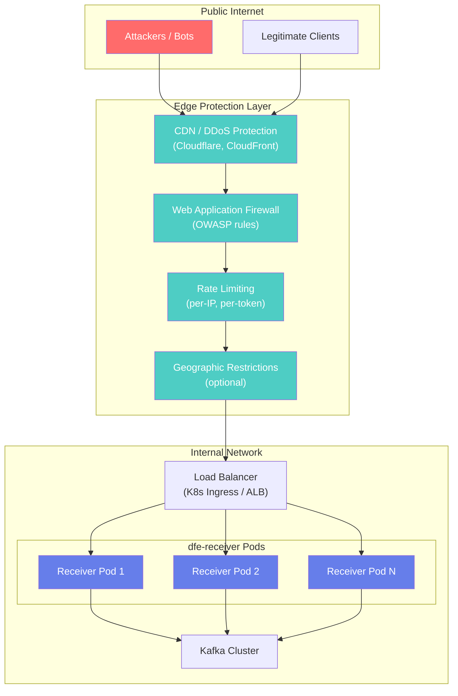
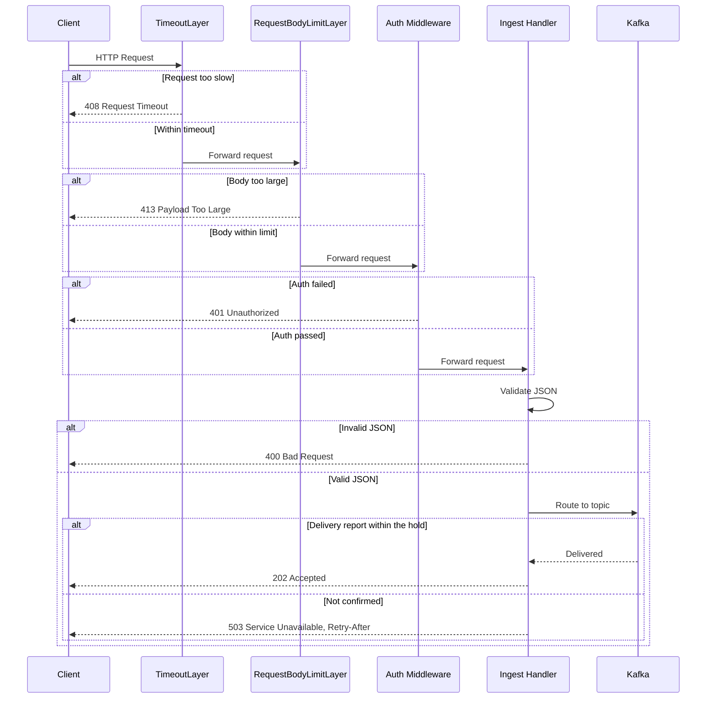

# dfe-receiver Design Document

## Overview

dfe-receiver is a high-performance HTTP/gRPC receiver for PB/s scale data ingestion. It replaces a Vector-based implementation with native Rust for maximum performance on the hot path.

## Requirements

### Functional Requirements

1. **Data Ingestion**
   - Receive JSON data over HTTP(S) and gRPC
   - Support Vector HTTP sink and Vector sink (gRPC) protocols
   - Accept data from any HTTP client (not limited to Vector)

2. **Validation**
   - Accept only valid JSON payloads
   - Optionally validate required fields (JSON path)
   - Route invalid data to DLQ or reject with error

3. **Routing**
   - Route to Kafka topics using configurable source rules (first match wins)
   - Rule modes: `key_present`, `key_value_set`, `key_value_use`
   - Source-to-topic remapping and default source ("main")
   - Legacy compat mode for `tags.event.category` / `event_category`
   - Support direct routing to dfe-loader
   - `_timestamp_receiver` enrichment (epoch ms injection)

4. **Authentication**
   - Header-based authentication (static values)
   - Bearer token authentication (static or from secret manager)
   - mTLS client certificate validation
   - Certificates from file or secret manager (AWS, OpenBao/Vault)

5. **Resilience**
   - A sender is answered once every destination confirmed its records (`acknowledgements.enabled`, default on)
   - For answers given at enqueue: in-memory buffering with backpressure, disk spillover opt-in
   - Circuit breaker for failing sinks
   - Memory pressure detection and backpressure

### Non-Functional Requirements

1. **Performance** - PB/s daily throughput capability
2. **Latency** - Sub-millisecond hot path processing
3. **Resource Efficiency** - Minimal allocations on hot path
4. **Observability** - Prometheus metrics, structured logging
5. **Operability** - Kubernetes-native (KEDA scaling, health probes)

## Architecture

```
                                   ┌─────────────────┐
                                   │   Config File   │
                                   │  (7-layer       │
                                   │   cascade)      │
                                   └────────┬────────┘
                                            │
┌──────────────┐                  ┌─────────▼─────────┐
│ Vector/HTTP  │──── HTTPS ──────▶│   HTTP Server    │
│   Client     │                  │   (axum + TLS)   │
└──────────────┘                  └─────────┬─────────┘
                                            │
┌──────────────┐                  ┌─────────▼─────────┐
│ Vector gRPC  │──── gRPC ───────▶│   gRPC Server    │
│   Client     │                  │   (tonic)        │
└──────────────┘                  └─────────┬─────────┘
                                            │
                                  ┌─────────▼─────────┐
                                  │  Auth Middleware  │
                                  │ (header/bearer/   │
                                  │  mTLS)            │
                                  └─────────┬─────────┘
                                            │
                                  ┌─────────▼─────────┐
                                  │  JSON Validator   │
                                  │  (sonic_rs)       │
                                  └─────────┬─────────┘
                                            │
                                  ┌─────────▼─────────┐
                                  │     Router        │
                                  │ (zero-copy field │
                                  │  extraction)      │
                                  └─────────┬─────────┘
                                            │
                         ┌──────────────────┼──────────────────┐
                         │                  │                  │
               ┌─────────▼─────────┐ ┌──────▼──────┐ ┌─────────▼─────────┐
               │   Kafka Sink      │ │ DLQ Sink    │ │  gRPC Sink        │
               │   (rdkafka)       │ │             │ │  (scalo Push)     │
               └─────────┬─────────┘ └─────────────┘ └───────────────────┘
                         │
               ┌─────────▼─────────┐
               │   TieredSink      │
               │ (circuit breaker  │
               │  + memory buffer)    │
               └───────────────────┘
```

## Hot Path Design

The hot path is critical for PB/s throughput. Key optimizations:

### Zero-Copy Processing

```rust
// Payload stays as bytes::Bytes throughout
async fn ingest_handler(body: Bytes) -> StatusCode {
    // 1. Validate JSON without full parse (sonic_rs LazyValue)
    // 2. Extract routing field with zero-copy (Cow<str>)
    // 3. Send to batcher (Bytes reference)
}
```

### Memory Efficiency

- `bytes::Bytes` for payload (reference-counted, no copy on clone)
- `Cow<str>` for extracted fields (borrow when no escaping needed)
- `FxHashMap` for source-to-topic lookups (faster than std HashMap)
- Pre-allocated batch vectors

### Minimal Allocations

- No `format!()` on hot path
- Avoid `String::to_string()` when `&str` suffices
- Use `#[inline]` on critical functions

## Component Details

### HTTP Server (axum)

- Tower middleware for auth layers
- Graceful shutdown support
- TLS termination with rustls
- Health endpoints for Kubernetes

### gRPC Server (tonic)

- Vector sink protocol compatibility
- Shared routing/batching pipeline with HTTP
- Same auth middleware (via Tower)

### JSON Validation (sonic_rs)

- SIMD-accelerated parsing
- `LazyValue` for validation without full DOM
- `get_from_slice()` for on-demand field extraction

### Router

Source-rule-based routing (first match wins):

```rust
pub fn route(&self, payload: &Bytes) -> RouteResult {
    // Evaluate source rules (zero-copy field extraction)
    let source = self.evaluate_source(payload)
        .unwrap_or_else(|| self.default_source.clone());

    // Optional source-to-topic remapping
    let topic = self.source_to_topic
        .get(&source)
        .unwrap_or(&source);

    RouteResult::Kafka(format!("{topic}{}", self.topic_suffix))
}
```

### Kafka Authentication

SASL-SCRAM-SHA-512 is the standard mechanism for all production deployments.
It works across Apache Kafka, AutoMQ, AWS MSK, Confluent Cloud, and Redpanda
with no code changes. Certificate-based auth (mTLS) and AWS IAM have high
variance between platforms — avoid for cross-platform workloads.

| Scenario | Protocol |
|----------|----------|
| External / internet-facing | `SASL_SSL` |
| Internal K8s (pod-to-pod) | `SASL_PLAINTEXT` |
| Local dev only | `PLAINTEXT` (no auth, no TLS) |

### Kafka Batching

Per-topic batching with configurable thresholds:

- **Size**: 8 MiB default
- **Count**: 10,000 messages default
- **Time**: 20ms linger

Uses rdkafka `FutureProducer` with zstd compression.

### TieredSink

Wraps primary sink with resilience:

1. **Circuit Breaker** (scalo) - Tracks consecutive failures, opens after threshold
2. **In-Memory Queue** - Buffers during circuit-open state
3. **Background Drain** - Retries queued messages when circuit closes

### What a sender is told

A record the pipeline could not take -- memory pressure, a full queue, a destination down, a route with no sink -- is answered with the protocol's retry signal. One refused for good -- malformed, over a destination's size ceiling -- gets its non-retryable answer. A batch stops at the first record not taken, and the sender resends the whole request, so records taken before it arrive twice. With acknowledgements on, a request whose records were not all confirmed within the hold gets the same retry signal for the whole request.

| Listener | Could not take | Refused for good | The protocol rule behind it |
|---|---|---|---|
| HTTP `/ingest`, webhook | 503, `Retry-After: 5` | 400 | RFC 9110 15.6.4: 503 is a temporary condition, and `Retry-After` says when to come back |
| Splunk HEC | 503, code 9 "Server is busy", `Retry-After` | 400, code 6 "Invalid data format" | Splunk answers 503 code 9 when its queue cannot take a payload; HEC senders such as the OpenTelemetry Collector's exporter retry 429 and 503, honouring `Retry-After`, and treat 400, 401 and 403 as permanent |
| Prometheus Remote Write | 503, `Retry-After` | 400 | Remote Write 1.0: senders MUST retry a 5xx and MUST NOT retry a 2xx or a 4xx other than 429 |
| OTLP gRPC | `UNAVAILABLE` | OK with `partial_success`, or `INVALID_ARGUMENT` when every record is refused | OTLP: `UNAVAILABLE` is retryable, `INTERNAL` is not, and a client MUST NOT retry an export whose `partial_success` is populated |
| gRPC push (`vector.Vector/PushEvents`) | `UNAVAILABLE` | `INVALID_ARGUMENT` | the protocol's peer, Vector's `vector` sink, retries every code but `NotFound`, `InvalidArgument`, `AlreadyExists`, `PermissionDenied`, `OutOfRange`, `Unimplemented`, `Unauthenticated` and `DataLoss` -- so `INTERNAL`, the old answer to everything, was retried even for a record that can never land |
| OTLP HTTP | 503, `Retry-After` | 200 with `partial_success`, or 400 when every record is refused | OTLP: 429, 502, 503 and 504 SHOULD be retried, every other 4xx and 5xx MUST NOT be, and `Retry-After` SHOULD be honoured |
| Lumberjack (Beats) | ACK for the events taken, then the connection closes | acknowledged, counted dropped | go-lumber reads a partial ACK as progress and a closed connection as an error, on which Beats re-queues the window's unacknowledged events |
| Fluent Forward with `chunk` | no ack, then the connection closes | acknowledged, counted dropped | Forward v1: a client SHOULD resend a chunk whose request got no `ack` |
| Syslog TCP/TLS, GELF TCP, Fluent Forward without `chunk` | the socket is held unread and the record offered again, backing off to 2s | counted dropped | none of these carries an acknowledgement, so TCP flow control is the only signal a sender reads |
| Syslog UDP | counted dropped | counted dropped | a datagram carries no answer |

No answer carries the receiver's internals: a refused record is told why only when the record itself is at fault, and every other cause is logged and answered with the protocol's generic wording.

"Counted dropped" is `receiver_records_dropped_total{transport,reason}`: a record gone with no way to tell its sender, `reason` one of `unavailable`, `rejected` or `shutdown` (a held record dropped at shutdown). The flow listeners count their drops in `transport_drops_total`.

With acknowledgements on (the default), each answer above is given once the destinations confirmed the records; with them off, once the record is in the receiver's buffer. See [architecture.md](architecture.md#delivery-the-answer-waits-for-the-destination).

### Authentication

#### Bearer Token Provider

```rust
pub struct BearerTokenProvider {
    token_hashes: RwLock<HashSet<TokenHash>>,  // SHA-256 of each token, swapped on reload
    shutdown_tx: broadcast::Sender<()>,
}
```

Static tokens, `accepted_headers[].values` and `header_values` are `SensitiveString`: redacted when the config is serialised, and marked `x-dfe-secret` in the config schema. A presented credential is compared by its SHA-256 hash.

Supports:

- Static tokens (development)
- Dynamic loading from secret managers
- Background refresh with configurable interval
- Token rotation without restart

Secret source format: `provider:path[:key]`, resolved by
`scalo::secrets::resolve` -- the receiver has no resolver of its own.

- `file:/etc/secrets/tokens`
- `vault:secret/data/auth:bearer_tokens`
- `env:DFE_RECEIVER_BEARER_TOKENS`

AWS Secrets Manager is not compiled in: serving `aws:` means pulling the AWS SDK
for a path nothing uses, so the spec is refused at startup naming the scalo
feature instead.

## Configuration

7-layer cascade (scalo pattern):

1. Compiled defaults
2. `/etc/dfe-receiver/config.yaml`
3. `./config.yaml`
4. `~/.config/dfe-receiver/config.yaml`
5. Environment variables (`DFE_RECEIVER_*`)
6. CLI arguments
7. Runtime overrides

### Example Configuration

```yaml
server:
  bind_address: "0.0.0.0:443"
  tls:
    enabled: true
    cert_file: "/etc/ssl/receiver.crt"
    key_file: "/etc/ssl/receiver.key"
  auth:
    mode: bearer
    bearer:
      secret_source: "vault:secret/data/auth:tokens"
      refresh_interval_secs: 300

validation:
  require_json: true
  required_fields: ["org_id"]
  dlq_on_invalid: true

routing:
  source_rules:
    - field: "_source"
      mode: "key_value_use"
  default_source: "main"
  topic_suffix: "_land"
  legacy_compat: false
  # source_to_topic:
  #   auth: "logs_auth"
  dlq:
    enabled: true
    topic: "dfe_receiver_dlq"

kafka:
  brokers: ["kafka.example.com:9094"]
  sasl:
    enabled: true
    mechanism: scram_sha_512   # Works for Apache Kafka, AutoMQ, MSK, Confluent Cloud
    username: dfe-receiver
    password: "${KAFKA_PASSWORD}"
  tls:
    enabled: true              # SASL_SSL for external listeners; omit for internal K8s
  producer:
    batch_size: 8388608
    batch_messages: 10000
    linger_ms: 20
    compression: zstd

buffer:
  memory_limit: 0  # Auto (85% of the cgroup limit)
  pressure_threshold: 0.8

metrics:
  address: "0.0.0.0:9090"
```

### Raw payload retention

Opt-in retention of the original wire payload in the dfe-schemas common-header
`_raw` field. The parsed event is unchanged -- `_raw` is an addition to it.

dfe-loader already fills `_raw` by renaming
`first(logoriginal/_raw/raw/raw_log/message)`, and is a silent no-op when
`_raw` is already present, so a receiver-populated value wins without any
loader change. The reason to populate it here is fidelity the loader cannot
recover: for syslog its fallback lands `message`, the parsed body, after the
PRI, the header and the exact wire spacing are gone. `syslog_loose` never
errors either, so a malformed line silently becomes `message = <whole line>`
and is indistinguishable from a clean parse. Only `_raw` separates them.

Capture is off by default for two reasons. It roughly doubles produced bytes
for text protocols, on top of a full-text index downstream. And `_raw` is the
payload *before* parsing, so redaction, masking or field-dropping applied
downstream to the parsed fields does not reach it -- a credential or PII value
stripped from `message` still sits in `_raw`, indexed for full-text search.
Enable capture for a source only when retaining its raw payload at that
sensitivity is acceptable, and redact `_raw` explicitly wherever the parsed
fields are redacted.

```yaml
raw_capture:              # common default for every capturing transport
  enabled: false
  max_bytes: 65536        # 0 = unlimited
  on_oversize: truncate   # truncate | omit
syslog:
  raw_capture:
    enabled: true         # per-transport override, inherits the rest
```

Every field is optional at both levels: an unset field inherits, so "off" and
"not configured" stay distinguishable. Flat env vars work at both levels
(`DFE_RECEIVER_RAW_CAPTURE_ENABLED`,
`DFE_RECEIVER_SYSLOG_RAW_CAPTURE_ENABLED`).

| Transport | What `_raw` holds |
|-----------|-------------------|
| `syslog` | the wire line verbatim, PRI and header included |
| `gelf` | the message as it arrived, before `message`/`severity`/`_source` |
| `fluent` | the record's msgpack-to-JSON decode, before tag/timestamp |
| `splunk_hec` | `/event`: the submitted `event` value before metadata merge; `/raw`: the original line bytes |
| `prometheus_rw` | the `native`-mode rendering of the sample |
| `otlp` | the `generic`-mode rendering of the record |
| `flow` | the decoder's verbatim records -- a JSON array in `canonical`, the single record in `exploded` |

`http`, `grpc` and `lumberjack` do not offer the knob: they pass the payload
through untouched, so `_raw` would be a byte-for-byte copy of the event.

For `prometheus_rw` in `native` mode and `otlp` in `generic` mode, `_raw` is a
copy of the event, because that mode already IS the least-shaped rendering.
Both log a warning at startup. The field is still emitted so downstream sees
one schema whichever mode the receiver runs in.

Two markers travel with the value when they apply, so a mangled capture cannot
be mistaken for a faithful one:

- `_raw_truncated: true` -- the tail was dropped to respect `max_bytes`
- `_raw_lossy: true` -- invalid UTF-8 was replaced with U+FFFD

`_raw` exists only in the `timeseries` common-header profile. A source using
`minimal` or `passthrough` pays for capture at the receiver and has the field
dropped at the loader; the receiver cannot see the destination profile, so
this is not checked.

## Webhook intake

`POST /webhook/{caller}` is the door for products that push events -- an alert
rule, a SaaS notification hook -- rather than agents that stream them. It is
its own protocol handler (`src/server/webhook/`), not a bolt-on to `/ingest`:
`/ingest` checks one server-wide credential in middleware before the body is
read, a product is identified per caller and a signed request needs the body;
a product's payload shape is its own, so `routing.source_rules` cannot pick its
topic; and an own listener lets a deployment expose only this port to the
product's egress.

```mermaid
flowchart LR
    P["Product<br/>(alert rule, hook)"] -->|"POST /webhook/{caller}"| L["Listener<br/>shared ingest port, or webhook.bind_address"]
    L --> LIM["Body limit (webhook.max_body_size)<br/>413 + body_size_rejected"]
    LIM --> CALLER["Caller lookup<br/>404 unknown_caller"]
    CALLER --> AUTH["Per-caller auth<br/>hmac: HMAC-SHA256 over ts.body, replay window<br/>header: hashed shared secret"]
    AUTH -->|401 reason| P
    AUTH --> READY["Readiness<br/>503 + retry-after"]
    READY --> SPLIT["body: single | array"]
    SPLIT --> FILTER["CEL filter<br/>compiled at load, false drops"]
    FILTER --> STAMP["_source = caller<br/>_timestamp_receiver"]
    STAMP --> TOPIC["process_to_topic(caller.topic)"]
    TOPIC --> KAFKA[("Kafka")]
```



Two authentication modes, chosen per caller:

| Mode | What the product sends | What it proves | Replay |
|---|---|---|---|
| `hmac` | `X-Signature: sha256=HMAC(secret, "{ts}.{body}")`, `X-Timestamp: <unix secs>` | The body is unmodified and was signed by the secret holder | Refused outside `tolerance_secs` (default 300) as `stale_signature` |
| `header` | A fixed header carrying the shared secret | The sender holds the secret | None -- restrict the source with `server.ip_filter` |

`header` exists because some products can only attach static headers to a
webhook (runZero alert rules are the first caller and the reason); it is the
weaker mode and opt-in per caller. In both modes the secret is a
`provider:path[:key]` reference resolved through the same reader as bearer
tokens, refreshed on an interval, never a literal in the config file.

The path names the caller, so a wrong secret is only tried against one secret
set and callers never share a credential. Authentication runs before the
readiness check, so an unauthenticated client learns nothing about the
pipeline. Failures log at debug and count under
`dfe_receiver_auth_failures_total{reason}`; a credential spray writes no warn
line per attempt.

Delivery goes through `process_to_topic`, which validates and back-pressures
but skips the router's enrichment, so the handler stamps `_source` (the caller
name, which wins over a sender-supplied value) and `_timestamp_receiver`
itself. In `body: array` mode every element is checked, filtered and stamped
before any is delivered, so one element that is not an object refuses the
whole request as a 400 with nothing on the topic and the sender's retry
duplicates nothing. An oversize body is a 413 plus `body_size_rejected_total`,
never a DLQ entry: unauthenticated bytes do not enter Kafka.

`webhook.bind_address` unset merges the routes into the ingest listener after
its auth middleware and body limit have been applied to the ingest routes, so
the webhook keeps its own per-caller auth and smaller body limit while sharing
`server.tls`, `server.ip_filter`, `server.rate_limit` and the concurrency cap.
Set, the intake runs on its own port through the same hardened accept loops
and the same rate limit and concurrency cap, under `webhook.tls`.

Configuring a caller end to end -- the authentication choice, the secret
reference, the replay window, the body shape and the filter, with worked
examples and the statuses a sender sees -- is in
[WEBHOOK-SETUP.md](WEBHOOK-SETUP.md).

## Deployment

### Kubernetes with KEDA

The chart in this repo scales on CPU alone: 80% utilisation, 1 to 10 replicas,
set under `keda.*` in `chart/values.yaml`. The suite's shared chart library adds
the ScalingPressure trigger on top. The receiver never scales on raw Kafka
consumer lag.

```yaml
triggers:
  - type: cpu
    metricType: Utilization
    metadata:
      value: "80"
```

### Health Probes

Probes hit the metrics listener (9090, port name `metrics`), not the ingest
port, so a saturated intake does not fail its own liveness check.

`/readyz` answers 503 until every listener an enabled handler binds is serving, again once any of them stops, and under memory pressure. A destination outage does not fail it, and ingest sheds per request with 503 instead. The ingest port's `/readyz` gives the same answer.

```yaml
livenessProbe:
  httpGet:
    path: /livez
    port: metrics
readinessProbe:
  httpGet:
    path: /readyz
    port: metrics
```

## Metrics

### Request Metrics

| Metric | Type | Description |
|--------|------|-------------|
| `receiver_requests_total` | Counter | Total requests received |
| `receiver_requests_success` | Counter | Total successful requests |
| `receiver_requests_error` | Counter | Total failed requests |
| `receiver_bytes_received_total` | Counter | Total bytes ingested |
| `receiver_records_dropped_total` | Counter | Records dropped with no way to tell the sender, by `transport` and `reason` (`unavailable`, `rejected`, `shutdown`) |

### Kafka Metrics

Enqueue and delivery are separate counts. librdkafka takes a record into its
own queue first and a broker answers for it later, so a record can be enqueued
and never delivered -- the delivery counters are the ones that say a broker
holds it.

| Metric | Type | Description |
|--------|------|-------------|
| `receiver_kafka_sends_total` | Counter | Messages librdkafka queued |
| `receiver_kafka_bytes_sent_total` | Counter | Bytes queued to Kafka |
| `receiver_kafka_send_errors_total` | Counter | Messages librdkafka refused to queue |
| `receiver_kafka_delivered_total` | Counter | Messages a broker acknowledged |
| `receiver_kafka_delivery_failures_total` | Counter | Messages no broker confirmed, by `reason` (librdkafka error code); a timed-out message may still have been written |
| `records_dlq_total` | Counter | Messages sent to DLQ (scalo emits this one) |
| `receiver_records_rejected_total` | Counter | Records a destination can never take (over its size ceiling), on any sink, by `outcome`: `dead_lettered`, `dropped` when no DLQ is configured, or `dlq_refused` when the DLQ did not confirm the write and the sender was told to retry |

### Scaling Metrics

| Metric | Type | Description |
|--------|------|-------------|
| `receiver_scaling_pressure` | Gauge | Scaling pressure for autoscaling (0-100) |

### Scaling Metric

Composite metric for KEDA scaling:

```
scaling_metric = max(
    memory_pressure,
    queue_depth / max_queue,
    request_rate / target_rate
)
```

## Testing Strategy

### Unit Tests

- JSON validation (valid, invalid, edge cases)
- Router field extraction and topic mapping
- Batcher flush triggers (size, count, time)
- Auth validation (header, bearer, mTLS)

### Integration Tests

- HTTP endpoint with test payloads
- gRPC endpoint with Vector protocol
- Kafka producer (testcontainers)
- TLS/mTLS validation
- Backpressure scenarios

### Performance Tests

```bash
# Benchmark hot path
cargo bench

# Load test
k6 run --vus 100 --duration 60s load-test.js

# Memory profiling
cargo run --release --features dhat-heap
```

## Security Architecture

### Deployment Requirements

> **CRITICAL**: dfe-receiver MUST NOT be directly exposed to the public internet.
> It should always be deployed behind edge protection infrastructure.

The receiver is designed as the **final layer** in a defense-in-depth architecture. Edge infrastructure handles volumetric attacks, bot filtering, and rate limiting, while the receiver focuses on authenticated payload processing.

### Required Deployment Architecture



### Security Controls by Layer

```mermaid
flowchart LR
    subgraph Edge["Edge Layer<br/>(CDN/WAF)"]
        E1["DDoS mitigation"]
        E2["Bot detection"]
        E3["Rate limiting"]
        E4["Geo-blocking"]
        E5["WAF rules"]
        E6["TLS termination"]
    end

    subgraph LB["Load Balancer"]
        L1["Connection limits"]
        L2["Health checks"]
        L3["Traffic distribution"]
    end

    subgraph Receiver["dfe-receiver"]
        R1["Request timeout<br/>(slow loris)"]
        R2["Body size limit<br/>(memory DoS)"]
        R3["TLS handshake timeout<br/>(TLS attacks)"]
        R4["Auth middleware<br/>(bearer/header/mTLS)"]
        R5["JSON validation"]
        R6["Structured logging"]
    end

    Edge --> LB --> Receiver
```



### Layer Responsibilities

| Attack Vector | Edge Layer | Load Balancer | dfe-receiver |
|--------------|------------|---------------|--------------|
| **DDoS / Volumetric** | Absorbs | - | - |
| **Bot Traffic** | Blocks | - | - |
| **Rate Abuse** | Limits | - | - |
| **Geographic** | Blocks | - | - |
| **WAF Signatures** | Blocks | - | - |
| **Connection Exhaustion** | - | Limits | - |
| **Slow Loris** | - | - | Request timeout |
| **Memory DoS (large body)** | - | - | Body size limit |
| **Slow TLS** | - | - | Handshake timeout |
| **Unauthenticated Access** | - | - | Auth middleware |
| **Malformed JSON** | - | - | Validation |
| **Invalid Payloads** | - | - | DLQ routing |

### Request Processing Order

The receiver applies security controls in a specific order to minimize resource usage for malicious requests:



### Security Configuration

```yaml
server:
  # Request limits (applied BEFORE auth to minimize cost)
  max_body_size: 10485760        # 10MB - reject larger payloads
  request_timeout_ms: 30000      # 30s - reject slow clients

  tls:
    enabled: true
    cert_file: "/etc/ssl/receiver.crt"
    key_file: "/etc/ssl/receiver.key"
    ca_file: "/etc/ssl/ca.crt"      # For mTLS
    client_auth: required            # none, optional, required

  auth:
    mode: both                       # none, header, bearer, mtls, both
    accepted_headers:
      - name: "x-api-key"
        values: ["production-key-1", "production-key-2"]
    bearer:
      secret_source: "vault:secret/data/auth:tokens"
      refresh_interval_secs: 300     # Hot-reload tokens
```

### TLS Hardening

The receiver includes TLS hardening for mTLS deployments:

- **Handshake timeout**: 10 seconds (prevents slow TLS attacks)
- **Modern cipher suites**: Via rustls (no legacy ciphers)
- **Client certificate validation**: Optional or required mTLS
- **Certificate refresh**: Supports secret manager integration

### Auth Middleware Order

Authentication is enforced **before** body processing to minimize resource usage:

1. **TimeoutLayer** - Rejects slow requests (slow loris protection)
2. **RequestBodyLimitLayer** - Rejects oversized requests before reading
3. **Auth Middleware** - Rejects unauthenticated requests before processing
4. **Handler** - Only reached by authenticated, properly-sized, timely requests

This order ensures minimal CPU/memory usage for bot scans and unauthenticated probes.

### What NOT to Implement in dfe-receiver

The following are intentionally NOT implemented because edge infrastructure handles them more efficiently:

| Feature | Reason |
|---------|--------|
| Rate limiting | Edge layer handles this with dedicated infrastructure |
| IP allowlist/blocklist | Edge layer or network policy handles this |
| Connection limits | Kubernetes or load balancer handles this |
| Access logging | Edge provides this; duplicating wastes resources |
| Bot detection | WAF/CDN provides sophisticated detection |
| Geographic blocking | Edge layer handles with IP geolocation |

### Monitoring and Alerting

Key security metrics to monitor:

```yaml
# Prometheus alerts
groups:
  - name: dfe-receiver-security
    rules:
      - alert: HighAuthFailureRate
        expr: rate(receiver_requests_error[5m]) > 100
        labels:
          severity: warning
        annotations:
          summary: "High authentication failure rate"

      - alert: HighValidationFailureRate
        expr: rate(receiver_messages_dlq_total[5m]) > 50
        labels:
          severity: warning
        annotations:
          summary: "High validation failure rate - check DLQ"

      - alert: RequestTimeoutSpike
        expr: rate(receiver_requests_error[5m]) > 10
        labels:
          severity: info
        annotations:
          summary: "Request timeout spike - possible slow loris attempt"
```

## Flow (NetFlow + sFlow) -- EXPERIMENTAL

Native UDP ingestion for NetFlow v5/v9, IPFIX, and sFlow v5 with autosense
dispatch and configurable output modes.

**Status:** EXPERIMENTAL when first enabled. Handler emits a startup `WARN`
log and sets `dfe_handler_experimental{handler="flow"} 1`. Set
`flow.experimental: false` once stability is proven.

### Ports

| Port | Convention | Accepts |
|---|---|---|
| 2055/udp | NetFlow historic | v5/v9/IPFIX/sFlow (autosense) |
| 4739/udp | IPFIX IANA | v5/v9/IPFIX/sFlow (autosense) |
| 6343/udp | sFlow IANA | v5/v9/IPFIX/sFlow (autosense) |

### Output modes

- `canonical` (default) -- one JSON envelope per UDP datagram with `flows: [...]` array
- `exploded` -- one JSON envelope per flow record (amplifies events; use for per-flow analytics)

Raw record retention is no longer a mode. `flow.raw_capture.enabled` adds the
decoder's verbatim output to the event's common-header `_raw` field, and works
with either mode -- a JSON array of every record in `canonical`, the single
record in `exploded`. See [Raw payload retention](#raw-payload-retention).

### Record kinds

- `flow` -- standard NetFlow / sFlow record
- `counter` -- sFlow counter sample (interface statistics)
- `security_event` -- NSEL firewall event (Cisco ASA firewallEvent / NF_F_FW_EVENT)
- `nat_translation` -- CGNAT NAT44 translation event (natEvent IE)

### Modes

- **Unified** (default): one listener per port accepts all flow protocols
- **Split**: opt-in via `flow.split:` -- separate NetFlow-only and sFlow-only listeners

### Configuration

See `config.example.yaml` for the full `flow:` block.

### Known limitations (v1)

- **NetFlow v7 is not supported.** v7 is a Cisco-proprietary variant for
  early-2000s Catalyst switches with hybrid L2+L3 flow tracking. Never widely
  adopted; current Cisco gear emits v9 or IPFIX. A v7 packet hitting our
  listener returns a parse error visible in
  `dfe_transport_decode_err_total{transport="netflow", reason="parse_err"}`.
  If a customer ever reports v7 exporters, support can be added reactively
  (~1 day of hand-rolled wire decode like our v5 implementation).
- Template-miss errors currently conflated with parse errors in metrics
  (`dfe_transport_decode_err_total{reason="template_miss"}` will be 0)
- Template cache `max_per_exporter` not yet enforced (netgauze limitation)
- `t_flow_start`/`t_flow_end` carry relative `sysup:<ms>` strings rather than
  absolute RFC 3339 timestamps (sysUpTime anchor resolution deferred)
- `recvmmsg(2)` batch syscall deferred. Linux listener uses `AsyncFd::readable`
  + per-packet `recv_from` drain loop (capped at 256 packets per readiness
  event). Functionally equivalent below ~100K pps.

## Completed Milestones

- [x] gRPC Vector sink protocol
- [x] Sidecar transport pattern (see `docs/SIDECAR-TRANSPORTS.md`)
- [x] Config hot-reload via SIGHUP (routing, validation, enrichment)
- [x] Source-rule-based routing (key_present, key_value_set, key_value_use)
- [x] `_timestamp_receiver` enrichment
- [x] 9-protocol multi-protocol ingestion (HTTP, gRPC, OTLP, Lumberjack, Splunk HEC, Syslog, Fluent, GELF, Prometheus RW)
- [x] Flow handler (NetFlow v5/v9/IPFIX + sFlow v5 + NSEL + NAT44, autosense UDP, EXPERIMENTAL)
- [x] Webhook intake (`POST /webhook/{caller}`, per-caller HMAC or static-header auth, per-caller topic)

## References

- [dfe-loader](https://github.com/hyperi-io/dfe-loader) - Reference implementation patterns
- [scalo](https://github.com/hyperi-io/scalo-rs) - Shared data-plane runtime (crate: `scalo`)
- [Vector HTTP sink](https://vector.dev/docs/reference/configuration/sinks/http/)
- [Vector sink (gRPC)](https://vector.dev/docs/reference/configuration/sinks/vector/)
