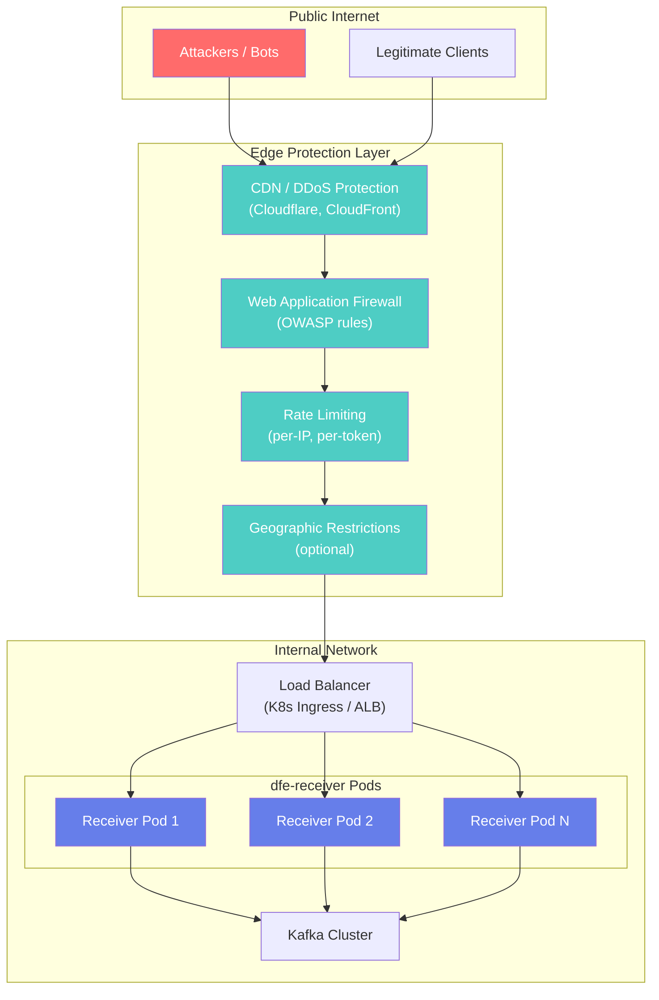
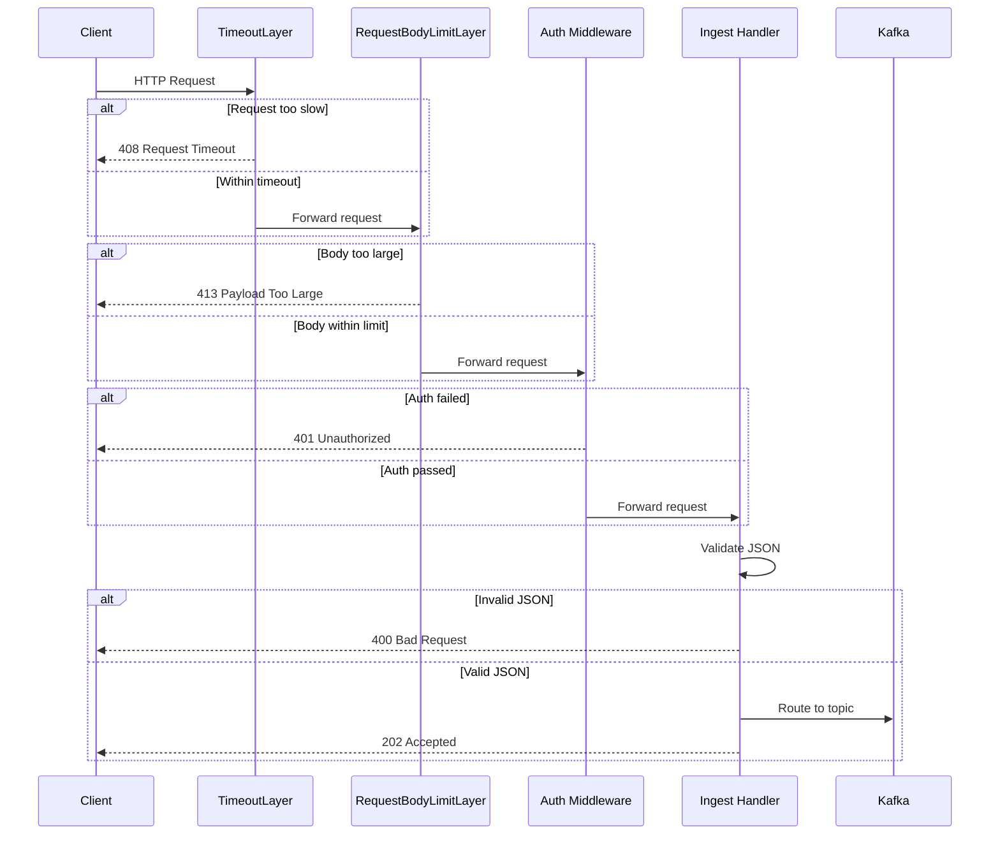

# dfe-receiver Design Document

## Overview

dfe-receiver is a high-performance HTTP/gRPC receiver for PB/s scale data ingestion. It replaces a Vector-based implementation with native Rust for maximum performance on the hot path.

## Requirements

### Functional Requirements

1. **Data Ingestion**
   - Receive JSON data over HTTP(S) and gRPC
   - Support Vector HTTP sink and Vector sink (gRPC) protocols
   - Accept data from any HTTP client (not limited to Vector)

2. **Validation**
   - Accept only valid JSON payloads
   - Optionally validate required fields (JSON path)
   - Route invalid data to DLQ or reject with error

3. **Routing**
   - Route to Kafka topics using configurable source rules (first match wins)
   - Rule modes: `key_present`, `key_value_set`, `key_value_use`
   - Source-to-topic remapping and default source ("dfe")
   - Legacy compat mode for `tags.event.category` / `event_category`
   - Support direct routing to dfe-loader
   - `_timestamp_receiver` enrichment (epoch ms injection)

4. **Authentication**
   - Header-based authentication (static values)
   - Bearer token authentication (static or from secret manager)
   - mTLS client certificate validation
   - Certificates from file or secret manager (AWS, OpenBao/Vault)

5. **Resilience**
   - Disk spillover when downstream unavailable
   - Circuit breaker for failing sinks
   - Memory pressure detection and backpressure

### Non-Functional Requirements

1. **Performance** - PB/s daily throughput capability
2. **Latency** - Sub-millisecond hot path processing
3. **Resource Efficiency** - Minimal allocations on hot path
4. **Observability** - Prometheus metrics, structured logging
5. **Operability** - Kubernetes-native (KEDA scaling, health probes)

## Architecture

```
                                   ┌─────────────────┐
                                   │   Config File   │
                                   │  (7-layer       │
                                   │   cascade)      │
                                   └────────┬────────┘
                                            │
┌──────────────┐                  ┌─────────▼─────────┐
│ Vector/HTTP  │──── HTTPS ──────▶│   HTTP Server    │
│   Client     │                  │   (axum + TLS)   │
└──────────────┘                  └─────────┬─────────┘
                                            │
┌──────────────┐                  ┌─────────▼─────────┐
│ Vector gRPC  │──── gRPC ───────▶│   gRPC Server    │
│   Client     │                  │   (tonic)        │
└──────────────┘                  └─────────┬─────────┘
                                            │
                                  ┌─────────▼─────────┐
                                  │  Auth Middleware  │
                                  │ (header/bearer/   │
                                  │  mTLS)            │
                                  └─────────┬─────────┘
                                            │
                                  ┌─────────▼─────────┐
                                  │  JSON Validator   │
                                  │  (sonic_rs)       │
                                  └─────────┬─────────┘
                                            │
                                  ┌─────────▼─────────┐
                                  │     Router        │
                                  │ (zero-copy field │
                                  │  extraction)      │
                                  └─────────┬─────────┘
                                            │
                         ┌──────────────────┼──────────────────┐
                         │                  │                  │
               ┌─────────▼─────────┐ ┌──────▼──────┐ ┌─────────▼─────────┐
               │   Kafka Sink      │ │ DLQ Sink    │ │  Loader Sink      │
               │   (rdkafka)       │ │             │ │  (hyperi-rustlib)     │
               └─────────┬─────────┘ └─────────────┘ └───────────────────┘
                         │
               ┌─────────▼─────────┐
               │   TieredSink      │
               │ (circuit breaker  │
               │  + disk spool)    │
               └───────────────────┘
```

## Hot Path Design

The hot path is critical for PB/s throughput. Key optimizations:

### Zero-Copy Processing

```rust
// Payload stays as bytes::Bytes throughout
async fn ingest_handler(body: Bytes) -> StatusCode {
    // 1. Validate JSON without full parse (sonic_rs LazyValue)
    // 2. Extract routing field with zero-copy (Cow<str>)
    // 3. Send to batcher (Bytes reference)
}
```

### Memory Efficiency

- `bytes::Bytes` for payload (reference-counted, no copy on clone)
- `Cow<str>` for extracted fields (borrow when no escaping needed)
- `FxHashMap` for source-to-topic lookups (faster than std HashMap)
- Pre-allocated batch vectors

### Minimal Allocations

- No `format!()` on hot path
- Avoid `String::to_string()` when `&str` suffices
- Use `#[inline]` on critical functions

## Component Details

### HTTP Server (axum)

- Tower middleware for auth layers
- Graceful shutdown support
- TLS termination with rustls
- Health endpoints for Kubernetes

### gRPC Server (tonic)

- Vector sink protocol compatibility
- Shared routing/batching pipeline with HTTP
- Same auth middleware (via Tower)

### JSON Validation (sonic_rs)

- SIMD-accelerated parsing
- `LazyValue` for validation without full DOM
- `get_from_slice()` for on-demand field extraction

### Router

Source-rule-based routing (first match wins):

```rust
pub fn route(&self, payload: &Bytes) -> RouteResult {
    // Evaluate source rules (zero-copy field extraction)
    let source = self.evaluate_source(payload)
        .unwrap_or_else(|| self.default_source.clone());

    // Optional source-to-topic remapping
    let topic = self.source_to_topic
        .get(&source)
        .unwrap_or(&source);

    RouteResult::Kafka(format!("{topic}{}", self.topic_suffix))
}
```

### Kafka Authentication

SASL-SCRAM-SHA-512 is the standard mechanism for all production deployments.
It works across Apache Kafka, AutoMQ, AWS MSK, Confluent Cloud, and Redpanda
with no code changes. Certificate-based auth (mTLS) and AWS IAM have high
variance between platforms — avoid for cross-platform workloads.

| Scenario | Protocol |
|----------|----------|
| External / internet-facing | `SASL_SSL` |
| Internal K8s (pod-to-pod) | `SASL_PLAINTEXT` |
| Local dev only | `PLAINTEXT` (no auth, no TLS) |

### Kafka Batching

Per-topic batching with configurable thresholds:

- **Size**: 8 MiB default
- **Count**: 10,000 messages default
- **Time**: 20ms linger

Uses rdkafka `FutureProducer` with zstd compression.

### TieredSink

Wraps primary sink with resilience:

1. **Circuit Breaker** (hyperi-rustlib) - Tracks consecutive failures, opens after threshold
2. **In-Memory Queue** - Buffers during circuit-open state
3. **Disk Spool** (planned) - Spillover when memory queue full
4. **Background Drain** - Retries queued messages when circuit closes

### Authentication

#### Bearer Token Provider

```rust
pub struct BearerTokenProvider {
    tokens: RwLock<HashSet<String>>,  // Thread-safe for hot reload
    shutdown_tx: broadcast::Sender<()>,
}
```

Supports:

- Static tokens (development)
- Dynamic loading from secret managers
- Background refresh with configurable interval
- Token rotation without restart

Secret source format: `provider:path:key`

- `file:/etc/secrets/tokens`
- `vault:secret/data/auth:bearer_tokens`
- `aws:prod/auth/tokens:bearer`

## Configuration

7-layer cascade (hyperi-rustlib pattern):

1. Compiled defaults
2. `/etc/dfe-receiver/config.yaml`
3. `./config.yaml`
4. `~/.config/dfe-receiver/config.yaml`
5. Environment variables (`DFE_RECEIVER_*`)
6. CLI arguments
7. Runtime overrides

### Example Configuration

```yaml
server:
  bind_address: "0.0.0.0:443"
  tls:
    enabled: true
    cert_file: "/etc/ssl/receiver.crt"
    key_file: "/etc/ssl/receiver.key"
  auth:
    mode: bearer
    bearer:
      secret_source: "vault:secret/data/auth:tokens"
      refresh_interval_secs: 300

validation:
  require_json: true
  required_fields: ["org_id"]
  dlq_on_invalid: true

routing:
  source_rules:
    - field: "_source"
      mode: "key_value_use"
  default_source: "dfe"
  topic_suffix: "_land"
  legacy_compat: false
  # source_to_topic:
  #   auth: "logs_auth"
  dlq:
    enabled: true
    topic: "dlq_land"

kafka:
  brokers: ["kafka.example.com:9094"]
  sasl:
    enabled: true
    mechanism: scram_sha_512   # Works for Apache Kafka, AutoMQ, MSK, Confluent Cloud
    username: dfe-receiver
    password: "${KAFKA_PASSWORD}"
  tls:
    enabled: true              # SASL_SSL for external listeners; omit for internal K8s
  producer:
    batch_size: 8388608
    batch_messages: 10000
    linger_ms: 20
    compression: zstd

buffer:
  memory_limit: 0  # Auto (67% of available)
  pressure_threshold: 0.8
  spool_path: "/var/spool/dfe-receiver"

metrics:
  address: "0.0.0.0:9090"
```

## Deployment

### Kubernetes with KEDA

```yaml
apiVersion: keda.sh/v1alpha1
kind: ScaledObject
metadata:
  name: dfe-receiver
spec:
  scaleTargetRef:
    name: dfe-receiver
  minReplicaCount: 2
  maxReplicaCount: 100
  triggers:
    - type: prometheus
      metadata:
        query: dfe_receiver_scaling_metric
        threshold: "0.7"
```

### Health Probes

```yaml
livenessProbe:
  httpGet:
    path: /health/live
    port: 8080
readinessProbe:
  httpGet:
    path: /health/ready
    port: 8080
```

## Metrics

### Request Metrics

| Metric | Type | Description |
|--------|------|-------------|
| `dfe_receiver_requests_total` | Counter | Total requests by status |
| `dfe_receiver_bytes_received_total` | Counter | Total bytes ingested |
| `dfe_receiver_request_duration_seconds` | Histogram | Request latency |

### Kafka Metrics

| Metric | Type | Description |
|--------|------|-------------|
| `dfe_receiver_kafka_messages_total` | Counter | Messages sent to Kafka |
| `dfe_receiver_kafka_bytes_total` | Counter | Bytes sent to Kafka |
| `dfe_receiver_kafka_batch_size` | Histogram | Batch sizes |

### Buffer Metrics

| Metric | Type | Description |
|--------|------|-------------|
| `dfe_receiver_buffer_spilled_total` | Counter | Messages spilled |
| `dfe_receiver_buffer_drained_total` | Counter | Messages drained |
| `dfe_receiver_buffer_queue_size` | Gauge | Current queue size |
| `dfe_receiver_memory_pressure` | Gauge | Memory pressure (0-1) |

### Scaling Metric

Composite metric for KEDA scaling:

```
scaling_metric = max(
    memory_pressure,
    queue_depth / max_queue,
    request_rate / target_rate
)
```

## Testing Strategy

### Unit Tests

- JSON validation (valid, invalid, edge cases)
- Router field extraction and topic mapping
- Batcher flush triggers (size, count, time)
- Auth validation (header, bearer, mTLS)

### Integration Tests

- HTTP endpoint with test payloads
- gRPC endpoint with Vector protocol
- Kafka producer (testcontainers)
- TLS/mTLS validation
- Backpressure scenarios

### Performance Tests

```bash
# Benchmark hot path
cargo bench

# Load test
k6 run --vus 100 --duration 60s load-test.js

# Memory profiling
cargo run --release --features dhat-heap
```

## Security Architecture

### Deployment Requirements

> **CRITICAL**: dfe-receiver MUST NOT be directly exposed to the public internet.
> It should always be deployed behind edge protection infrastructure.

The receiver is designed as the **final layer** in a defense-in-depth architecture. Edge infrastructure handles volumetric attacks, bot filtering, and rate limiting, while the receiver focuses on authenticated payload processing.

### Required Deployment Architecture



### Security Controls by Layer

```mermaid
flowchart LR
    subgraph Edge["Edge Layer<br/>(CDN/WAF)"]
        E1["DDoS mitigation"]
        E2["Bot detection"]
        E3["Rate limiting"]
        E4["Geo-blocking"]
        E5["WAF rules"]
        E6["TLS termination"]
    end

    subgraph LB["Load Balancer"]
        L1["Connection limits"]
        L2["Health checks"]
        L3["Traffic distribution"]
    end

    subgraph Receiver["dfe-receiver"]
        R1["Request timeout<br/>(slow loris)"]
        R2["Body size limit<br/>(memory DoS)"]
        R3["TLS handshake timeout<br/>(TLS attacks)"]
        R4["Auth middleware<br/>(bearer/header/mTLS)"]
        R5["JSON validation"]
        R6["Structured logging"]
    end

    Edge --> LB --> Receiver
```



### Layer Responsibilities

| Attack Vector | Edge Layer | Load Balancer | dfe-receiver |
|--------------|------------|---------------|--------------|
| **DDoS / Volumetric** | Absorbs | - | - |
| **Bot Traffic** | Blocks | - | - |
| **Rate Abuse** | Limits | - | - |
| **Geographic** | Blocks | - | - |
| **WAF Signatures** | Blocks | - | - |
| **Connection Exhaustion** | - | Limits | - |
| **Slow Loris** | - | - | Request timeout |
| **Memory DoS (large body)** | - | - | Body size limit |
| **Slow TLS** | - | - | Handshake timeout |
| **Unauthenticated Access** | - | - | Auth middleware |
| **Malformed JSON** | - | - | Validation |
| **Invalid Payloads** | - | - | DLQ routing |

### Request Processing Order

The receiver applies security controls in a specific order to minimize resource usage for malicious requests:



### Security Configuration

```yaml
server:
  # Request limits (applied BEFORE auth to minimize cost)
  max_body_size: 10485760        # 10MB - reject larger payloads
  request_timeout_ms: 30000      # 30s - reject slow clients

  tls:
    enabled: true
    cert_file: "/etc/ssl/receiver.crt"
    key_file: "/etc/ssl/receiver.key"
    ca_file: "/etc/ssl/ca.crt"      # For mTLS
    client_auth: required            # none, optional, required

  auth:
    mode: both                       # none, header, bearer, mtls, both
    accepted_headers:
      - name: "x-api-key"
        values: ["production-key-1", "production-key-2"]
    bearer:
      secret_source: "vault:secret/data/auth:tokens"
      refresh_interval_secs: 300     # Hot-reload tokens
```

### TLS Hardening

The receiver includes TLS hardening for mTLS deployments:

- **Handshake timeout**: 10 seconds (prevents slow TLS attacks)
- **Modern cipher suites**: Via rustls (no legacy ciphers)
- **Client certificate validation**: Optional or required mTLS
- **Certificate refresh**: Supports secret manager integration

### Auth Middleware Order

Authentication is enforced **before** body processing to minimize resource usage:

1. **TimeoutLayer** - Rejects slow requests (slow loris protection)
2. **RequestBodyLimitLayer** - Rejects oversized requests before reading
3. **Auth Middleware** - Rejects unauthenticated requests before processing
4. **Handler** - Only reached by authenticated, properly-sized, timely requests

This order ensures minimal CPU/memory usage for bot scans and unauthenticated probes.

### What NOT to Implement in dfe-receiver

The following are intentionally NOT implemented because edge infrastructure handles them more efficiently:

| Feature | Reason |
|---------|--------|
| Rate limiting | Edge layer handles this with dedicated infrastructure |
| IP allowlist/blocklist | Edge layer or network policy handles this |
| Connection limits | Kubernetes or load balancer handles this |
| Access logging | Edge provides this; duplicating wastes resources |
| Bot detection | WAF/CDN provides sophisticated detection |
| Geographic blocking | Edge layer handles with IP geolocation |

### Monitoring and Alerting

Key security metrics to monitor:

```yaml
# Prometheus alerts
groups:
  - name: dfe-receiver-security
    rules:
      - alert: HighAuthFailureRate
        expr: rate(dfe_receiver_auth_failures_total[5m]) > 100
        labels:
          severity: warning
        annotations:
          summary: "High authentication failure rate"

      - alert: HighValidationFailureRate
        expr: rate(dfe_receiver_validation_failures_total[5m]) > 50
        labels:
          severity: warning
        annotations:
          summary: "High validation failure rate - check DLQ"

      - alert: RequestTimeoutSpike
        expr: rate(dfe_receiver_request_timeout_total[5m]) > 10
        labels:
          severity: info
        annotations:
          summary: "Request timeout spike - possible slow loris attempt"
```

## Vector Agent Module

### Module Overview

Optional built-in Vector agent that ships as part of dfe-receiver, providing a
turnkey local collection pipeline. Vector runs as a managed subprocess — not
embedded as a library — with dfe-receiver handling lifecycle, configuration
generation, binary management, and health monitoring.

### Module Architecture

```text
┌─────────────────────────────────────────────────────┐
│                   dfe-receiver                       │
│                                                     │
│  ┌──────────────────┐    ┌───────────────────────┐  │
│  │  Vector Manager  │    │   Core Receiver       │  │
│  │                  │    │   (HTTP/gRPC server,   │  │
│  │  - Binary mgmt   │    │    validation,         │  │
│  │  - Config gen    │    │    routing, sinks)     │  │
│  │  - Health check  │    │                        │  │
│  │  - Auto-update   │    │   127.0.0.1:5480       │  │
│  └────────┬─────────┘    └───────────▲────────────┘  │
│           │                          │               │
│           │  spawns                  │  HTTP POST     │
│           ▼                          │  (JSON)        │
│  ┌────────────────────┐              │               │
│  │  vector (child     │──────────────┘               │
│  │  process)          │                              │
│  │                    │                              │
│  │  Sources:          │                              │
│  │  - file            │                              │
│  │  - journald        │                              │
│  │  - syslog          │                              │
│  │  - exec            │                              │
│  │  - etc.            │                              │
│  │                    │                              │
│  │  Sink:             │                              │
│  │  - http (→ core)   │                              │
│  └────────────────────┘                              │
└─────────────────────────────────────────────────────┘
```

### Why Subprocess (Not Embedded)

| Factor | Subprocess | Embedded library |
| -------- | ----------- | ----------------- |
| **Licensing** | Clean boundary — Vector (MPL-2.0) and dfe-receiver (FSL-1.1-ALv2) are separate binaries | Requires legal review of MPL-2.0 + FSL-1.1 compatibility |
| **Build complexity** | Zero impact on dfe-receiver build | Vector is 93+ crates, adds minutes to build time |
| **Stability** | Vector crashes don't take down the receiver | Panic in Vector code takes down the process |
| **Upgrades** | Vector binary updated independently | Requires full recompile |
| **API surface** | Well-documented CLI + config file | Internal APIs, undocumented, may break between releases |

### Binary Management

dfe-receiver manages the Vector binary automatically:

1. **Auto-download** — On first use or when version changes, download the
   correct platform binary from `packages.timber.io`
2. **Version pinning** — Config specifies a Vector version; dfe-receiver
   downloads that exact version
3. **Platform detection** — Automatically selects the correct binary:
   - `x86_64-unknown-linux-musl` (amd64)
   - `aarch64-unknown-linux-musl` (arm64)
4. **Checksum verification** — SHA256 verification of downloaded binary
5. **Auto-update** — Periodic check for newer versions based on update strategy
6. **Storage** — Binary cached in `$DFE_RECEIVER_DATA_DIR/vector/` or
   `/var/lib/dfe-receiver/vector/`

#### Update Strategies

| Strategy | Behaviour | Example (current latest: 0.54.2) |
| -------- | --------- | -------------------------------- |
| `pinned` | Exact version only, no auto-update | Uses whatever `version` is set to |
| `patch` | Latest patch within pinned minor | `version: "0.54.0"` → uses `0.54.2` |
| `n-1` **(default)** | Highest patch of the **previous** minor release | Latest is `0.54.x` → uses highest `0.53.x` |

The `n-1` strategy is the recommended production default. It ensures:

- **Stability** — you run a release that has had a full minor cycle of
  production exposure across the Vector community
- **Security** — patch releases within the n-1 minor are still applied
  automatically (CVE fixes, bug fixes)
- **Predictability** — you never get a new minor release's behaviour
  changes until the *next* minor ships, giving you a full release cycle
  of lead time

Resolution logic for `n-1`:

1. Query Vector releases (GitHub API or `packages.timber.io`)
2. Determine the latest minor version (e.g., `0.54`)
3. Select the previous minor (e.g., `0.53`)
4. Use the highest patch within that minor (e.g., `0.53.4`)

Download URL pattern:

```text
https://packages.timber.io/vector/{VERSION}/vector-{VERSION}-{ARCH}.tar.gz
```

### Configuration Generation

dfe-receiver generates Vector's `vector.yaml` from its own config:

```yaml
# dfe-receiver config (user-facing)
vector:
  enabled: true
  version: "0.53.0"           # used when strategy is pinned or patch
  update_strategy: "n-1"      # pinned | patch | n-1 (default: n-1)
  update_check_interval: 86400 # seconds between update checks (default: 24h)

  # Memory isolation (cgroups v2)
  memory_limit: "512MB"       # hard cap — Vector OOM-killed if exceeded
  memory_high: "400MB"        # soft cap — kernel throttles Vector before OOM

  # Vector config: use generated config OR supply your own
  config_path: ""             # path to custom vector.yaml (overrides sources below)

  # Source definitions (used when config_path is empty)
  sources:
    journald:
      enabled: true
      units: ["sshd", "nginx", "myapp"]
    files:
      enabled: true
      paths: ["/var/log/app/*.log"]
      encoding: "json"
    syslog:
      enabled: true
      address: "0.0.0.0:514"
      protocol: "udp"
```

#### Config Modes

Two modes for Vector configuration:

**Mode 1: Generated (default)** — define sources in dfe-receiver config,
the sink targeting the core receiver is auto-generated. Simple, no Vector
knowledge required.

**Mode 2: Custom vector.yaml** — set `config_path` to a user-supplied
`vector.yaml`. The receiver validates that the file contains at least one
sink pointing to the core receiver endpoint (`127.0.0.1:5480`), and warns
if missing. This mode gives full control over Vector's transforms, filters,
and advanced source options.

When `config_path` is set, the `sources` section is ignored entirely.

This generates a `vector.yaml` under the hood (Mode 1 only):

```yaml
# Auto-generated — do not edit
sources:
  journald_source:
    type: journald
    units:
      - sshd
      - nginx
      - myapp
  file_source:
    type: file
    include:
      - /var/log/app/*.log
    decoding:
      codec: json
  syslog_source:
    type: syslog
    address: 0.0.0.0:514
    mode: udp

sinks:
  dfe_receiver:
    type: http
    inputs: ["journald_source", "file_source", "syslog_source"]
    uri: http://127.0.0.1:5480/ingest
    encoding:
      codec: json
    buffer:
      type: disk
      max_size: 268435456  # 256MB disk buffer
    batch:
      max_bytes: 1048576
      timeout_secs: 1
    request:
      retry_max_duration_secs: 30
```

### Lifecycle Management

```text
dfe-receiver start
  │
  ├── Start core receiver (HTTP on 127.0.0.1:5480 + external on 0.0.0.0:443)
  │
  ├── Check vector.enabled == true
  │     │
  │     ├── Ensure vector binary exists at pinned version
  │     │     └── Download if missing or wrong version
  │     │
  │     ├── Generate vector.yaml from config
  │     │
  │     ├── Spawn: vector --config /run/dfe-receiver/vector.yaml
  │     │
  │     └── Monitor child process
  │           ├── Health check via Vector API (localhost:8686)
  │           ├── Restart on unexpected exit (backoff)
  │           └── Log forwarding (Vector stderr → receiver logs)
  │
  └── Shutdown
        ├── SIGTERM → vector child
        ├── Wait grace period (30s)
        └── SIGKILL if still running
```

### Memory Isolation (cgroups v2)

The Vector subprocess runs inside its own cgroup with a configurable memory
limit. This ensures a runaway Vector process is OOM-killed by the kernel
**without affecting the receiver or transformer**.

No system-level configuration is required — the receiver creates a child
cgroup under its own cgroup at runtime.

#### How It Works

1. On spawn, the receiver discovers its own cgroup via `/proc/self/cgroup`
2. Creates a child cgroup: `<own-cgroup>/vector/`
3. Enables memory controller: writes `+memory` to parent's
   `cgroup.subtree_control`
4. Sets limits:
   - `memory.high` → soft limit (throttle before OOM)
   - `memory.max` → hard limit (OOM kill)
5. Spawns Vector and writes its PID to `<own-cgroup>/vector/cgroup.procs`

#### Behaviour Under Pressure

```text
Vector memory usage rises
  │
  ├── Below memory.high (400MB)
  │     └── Normal operation
  │
  ├── Exceeds memory.high (400MB)
  │     └── Kernel throttles Vector (reclaims pages)
  │     └── Receiver logs warning, Vector slows down but stays alive
  │
  └── Exceeds memory.max (512MB)
        └── Kernel OOM-kills Vector process ONLY
        └── Receiver detects child exit, logs error
        └── Receiver restarts Vector with exponential backoff
        └── Receiver core pipeline unaffected — continues processing
```

#### Platform Requirements

| Environment | Cgroup delegation | Notes |
| ----------- | ----------------- | ----- |
| Kubernetes | Automatic | Container cgroup delegated by kubelet |
| systemd v252+ | Automatic | `Delegate=yes` in service unit (default) |
| systemd older | Config needed | Add `Delegate=yes` to service unit |
| Bare metal (root) | Works | Direct `/sys/fs/cgroup/` access |
| Unprivileged user | May not work | Falls back to no memory limit with warning |

If cgroup creation fails (permissions, cgroups v1 only, etc.), the receiver
logs a warning and spawns Vector without memory isolation — degraded but
functional.

### Health and Observability

- Vector's health API (`localhost:8686/health`) monitored by dfe-receiver
- Vector process status exposed via `/health/ready` (receiver not ready if Vector is down)
- Vector internal metrics scraped and re-exposed on dfe-receiver's Prometheus endpoint
- Vector stdout/stderr captured and logged through dfe-receiver's structured logger
- Vector memory usage (from cgroup stats) exposed as `dfe_vector_memory_bytes` gauge

### Shared Vector Management (hyperi-rustlib)

The Vector binary management (download, update strategies, checksum verification,
lifecycle, health monitoring) will be implemented in **hyperi-rustlib** as a
shared module, not directly in dfe-receiver. This is because other DFE services
— notably dfe-transform (TBC) — will also need managed Vector subprocesses.

dfe-receiver and dfe-transform will consume the same `hyperi_rustlib::vector`
module, providing consistent binary management, update strategies, and health
monitoring across the DFE suite.

### Licensing Note

Vector (MPL-2.0) is distributed as a separate binary. dfe-receiver (FSL-1.1-ALv2)
downloads and manages it but does not link to or incorporate Vector source code.
This maintains a clean license boundary — no MPL obligations attach to
dfe-receiver's codebase or to hyperi-rustlib.

## Future Work

- [ ] gRPC Vector sink protocol implementation
- [ ] Full disk spillover (currently in-memory only)
- [x] Sidecar transport pattern (Vector/Fluent Bit push to gRPC/HTTP ingest — see `docs/SIDECAR-TRANSPORTS.md`)
- [x] Config hot-reload via SIGHUP (routing, validation, enrichment)
- [x] Source-rule-based routing (key_present, key_value_set, key_value_use)
- [x] `_timestamp_receiver` enrichment
- [x] Rebranding: hs-rustlib to hyperi-rustlib

## References

- [dfe-loader](https://github.com/hyperi-io/dfe-loader) - Reference implementation patterns
- [hyperi-rustlib](https://github.com/hyperi-io/hyperi-rustlib) - Shared library
- [Vector HTTP sink](https://vector.dev/docs/reference/configuration/sinks/http/)
- [Vector sink (gRPC)](https://vector.dev/docs/reference/configuration/sinks/vector/)
