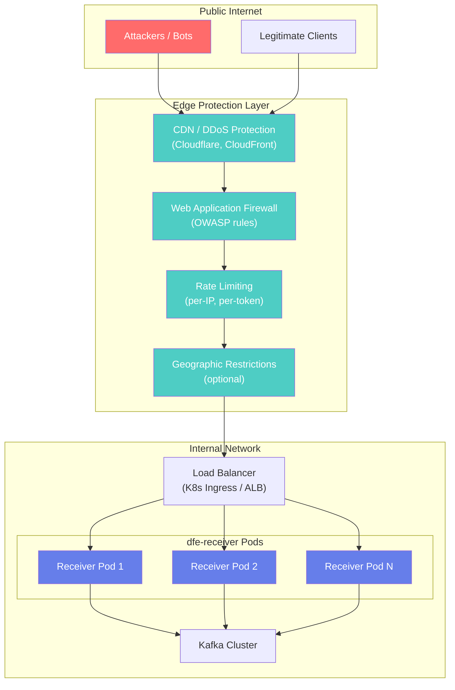
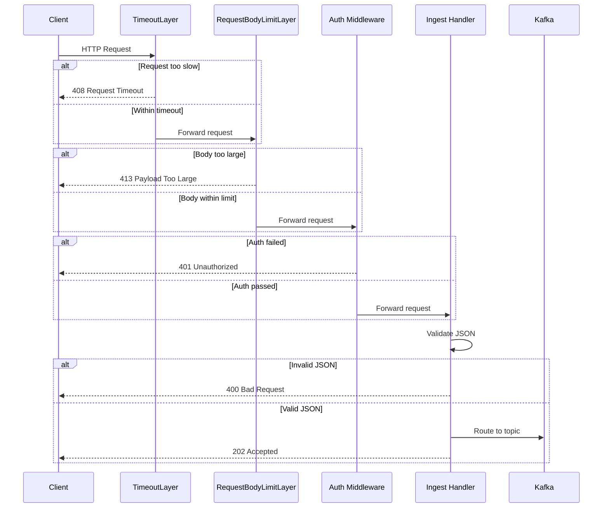

# dfe-receiver Design Document

## Overview

dfe-receiver is a high-performance HTTP/gRPC receiver for PB/s scale data ingestion. It replaces a Vector-based implementation with native Rust for maximum performance on the hot path.

## Requirements

### Functional Requirements

1. **Data Ingestion**
   - Receive JSON data over HTTP(S) and gRPC
   - Support Vector HTTP sink and Vector sink (gRPC) protocols
   - Accept data from any HTTP client (not limited to Vector)

2. **Validation**
   - Accept only valid JSON payloads
   - Optionally validate required fields (JSON path)
   - Route invalid data to DLQ or reject with error

3. **Routing**
   - Route to Kafka topics using configurable source rules (first match wins)
   - Rule modes: `key_present`, `key_value_set`, `key_value_use`
   - Source-to-topic remapping and default source ("default")
   - Legacy compat mode for `tags.event.category` / `event_category`
   - Support direct routing to dfe-loader
   - `_timestamp_receiver` enrichment (epoch ms injection)

4. **Authentication**
   - Header-based authentication (static values)
   - Bearer token authentication (static or from secret manager)
   - mTLS client certificate validation
   - Certificates from file or secret manager (AWS, OpenBao/Vault)

5. **Resilience**
   - In-memory buffering with backpressure (no disk spillover by design)
   - Circuit breaker for failing sinks
   - Memory pressure detection and backpressure

### Non-Functional Requirements

1. **Performance** - PB/s daily throughput capability
2. **Latency** - Sub-millisecond hot path processing
3. **Resource Efficiency** - Minimal allocations on hot path
4. **Observability** - Prometheus metrics, structured logging
5. **Operability** - Kubernetes-native (KEDA scaling, health probes)

## Architecture

```
                                   ┌─────────────────┐
                                   │   Config File   │
                                   │  (7-layer       │
                                   │   cascade)      │
                                   └────────┬────────┘
                                            │
┌──────────────┐                  ┌─────────▼─────────┐
│ Vector/HTTP  │──── HTTPS ──────▶│   HTTP Server    │
│   Client     │                  │   (axum + TLS)   │
└──────────────┘                  └─────────┬─────────┘
                                            │
┌──────────────┐                  ┌─────────▼─────────┐
│ Vector gRPC  │──── gRPC ───────▶│   gRPC Server    │
│   Client     │                  │   (tonic)        │
└──────────────┘                  └─────────┬─────────┘
                                            │
                                  ┌─────────▼─────────┐
                                  │  Auth Middleware  │
                                  │ (header/bearer/   │
                                  │  mTLS)            │
                                  └─────────┬─────────┘
                                            │
                                  ┌─────────▼─────────┐
                                  │  JSON Validator   │
                                  │  (sonic_rs)       │
                                  └─────────┬─────────┘
                                            │
                                  ┌─────────▼─────────┐
                                  │     Router        │
                                  │ (zero-copy field │
                                  │  extraction)      │
                                  └─────────┬─────────┘
                                            │
                         ┌──────────────────┼──────────────────┐
                         │                  │                  │
               ┌─────────▼─────────┐ ┌──────▼──────┐ ┌─────────▼─────────┐
               │   Kafka Sink      │ │ DLQ Sink    │ │  Loader Sink      │
               │   (rdkafka)       │ │             │ │  (scalo)          │
               └─────────┬─────────┘ └─────────────┘ └───────────────────┘
                         │
               ┌─────────▼─────────┐
               │   TieredSink      │
               │ (circuit breaker  │
               │  + memory buffer)    │
               └───────────────────┘
```

## Hot Path Design

The hot path is critical for PB/s throughput. Key optimizations:

### Zero-Copy Processing

```rust
// Payload stays as bytes::Bytes throughout
async fn ingest_handler(body: Bytes) -> StatusCode {
    // 1. Validate JSON without full parse (sonic_rs LazyValue)
    // 2. Extract routing field with zero-copy (Cow<str>)
    // 3. Send to batcher (Bytes reference)
}
```

### Memory Efficiency

- `bytes::Bytes` for payload (reference-counted, no copy on clone)
- `Cow<str>` for extracted fields (borrow when no escaping needed)
- `FxHashMap` for source-to-topic lookups (faster than std HashMap)
- Pre-allocated batch vectors

### Minimal Allocations

- No `format!()` on hot path
- Avoid `String::to_string()` when `&str` suffices
- Use `#[inline]` on critical functions

## Component Details

### HTTP Server (axum)

- Tower middleware for auth layers
- Graceful shutdown support
- TLS termination with rustls
- Health endpoints for Kubernetes

### gRPC Server (tonic)

- Vector sink protocol compatibility
- Shared routing/batching pipeline with HTTP
- Same auth middleware (via Tower)

### JSON Validation (sonic_rs)

- SIMD-accelerated parsing
- `LazyValue` for validation without full DOM
- `get_from_slice()` for on-demand field extraction

### Router

Source-rule-based routing (first match wins):

```rust
pub fn route(&self, payload: &Bytes) -> RouteResult {
    // Evaluate source rules (zero-copy field extraction)
    let source = self.evaluate_source(payload)
        .unwrap_or_else(|| self.default_source.clone());

    // Optional source-to-topic remapping
    let topic = self.source_to_topic
        .get(&source)
        .unwrap_or(&source);

    RouteResult::Kafka(format!("{topic}{}", self.topic_suffix))
}
```

### Kafka Authentication

SASL-SCRAM-SHA-512 is the standard mechanism for all production deployments.
It works across Apache Kafka, AutoMQ, AWS MSK, Confluent Cloud, and Redpanda
with no code changes. Certificate-based auth (mTLS) and AWS IAM have high
variance between platforms — avoid for cross-platform workloads.

| Scenario | Protocol |
|----------|----------|
| External / internet-facing | `SASL_SSL` |
| Internal K8s (pod-to-pod) | `SASL_PLAINTEXT` |
| Local dev only | `PLAINTEXT` (no auth, no TLS) |

### Kafka Batching

Per-topic batching with configurable thresholds:

- **Size**: 8 MiB default
- **Count**: 10,000 messages default
- **Time**: 20ms linger

Uses rdkafka `FutureProducer` with zstd compression.

### TieredSink

Wraps primary sink with resilience:

1. **Circuit Breaker** (scalo) - Tracks consecutive failures, opens after threshold
2. **In-Memory Queue** - Buffers during circuit-open state
3. **Background Drain** - Retries queued messages when circuit closes

### Authentication

#### Bearer Token Provider

```rust
pub struct BearerTokenProvider {
    tokens: RwLock<HashSet<String>>,  // Thread-safe for hot reload
    shutdown_tx: broadcast::Sender<()>,
}
```

Supports:

- Static tokens (development)
- Dynamic loading from secret managers
- Background refresh with configurable interval
- Token rotation without restart

Secret source format: `provider:path:key`

- `file:/etc/secrets/tokens`
- `vault:secret/data/auth:bearer_tokens`
- `aws:prod/auth/tokens:bearer`

## Configuration

7-layer cascade (scalo pattern):

1. Compiled defaults
2. `/etc/dfe-receiver/config.yaml`
3. `./config.yaml`
4. `~/.config/dfe-receiver/config.yaml`
5. Environment variables (`DFE_RECEIVER_*`)
6. CLI arguments
7. Runtime overrides

### Example Configuration

```yaml
server:
  bind_address: "0.0.0.0:443"
  tls:
    enabled: true
    cert_file: "/etc/ssl/receiver.crt"
    key_file: "/etc/ssl/receiver.key"
  auth:
    mode: bearer
    bearer:
      secret_source: "vault:secret/data/auth:tokens"
      refresh_interval_secs: 300

validation:
  require_json: true
  required_fields: ["org_id"]
  dlq_on_invalid: true

routing:
  source_rules:
    - field: "_source"
      mode: "key_value_use"
  default_source: "default"
  topic_suffix: "_land"
  legacy_compat: false
  # source_to_topic:
  #   auth: "logs_auth"
  dlq:
    enabled: true
    topic: "dlq_land"

kafka:
  brokers: ["kafka.example.com:9094"]
  sasl:
    enabled: true
    mechanism: scram_sha_512   # Works for Apache Kafka, AutoMQ, MSK, Confluent Cloud
    username: dfe-receiver
    password: "${KAFKA_PASSWORD}"
  tls:
    enabled: true              # SASL_SSL for external listeners; omit for internal K8s
  producer:
    batch_size: 8388608
    batch_messages: 10000
    linger_ms: 20
    compression: zstd

buffer:
  memory_limit: 0  # Auto (67% of available)
  pressure_threshold: 0.8

metrics:
  address: "0.0.0.0:9090"
```

## Deployment

### Kubernetes with KEDA

```yaml
apiVersion: keda.sh/v1alpha1
kind: ScaledObject
metadata:
  name: dfe-receiver
spec:
  scaleTargetRef:
    name: dfe-receiver
  minReplicaCount: 2
  maxReplicaCount: 100
  triggers:
    - type: prometheus
      metadata:
        query: dfe_receiver_scaling_metric
        threshold: "0.7"
```

### Health Probes

```yaml
livenessProbe:
  httpGet:
    path: /livez
    port: 8080
readinessProbe:
  httpGet:
    path: /readyz
    port: 8080
```

## Metrics

### Request Metrics

| Metric | Type | Description |
|--------|------|-------------|
| `receiver_requests_total` | Counter | Total requests received |
| `receiver_requests_success` | Counter | Total successful requests |
| `receiver_requests_error` | Counter | Total failed requests |
| `receiver_bytes_received_total` | Counter | Total bytes ingested |

### Kafka Metrics

| Metric | Type | Description |
|--------|------|-------------|
| `receiver_messages_sent_kafka_total` | Counter | Messages sent to Kafka |
| `receiver_messages_sent_loader_total` | Counter | Messages sent to loader |
| `receiver_messages_dlq_total` | Counter | Messages sent to DLQ |

### Scaling Metrics

| Metric | Type | Description |
|--------|------|-------------|
| `receiver_scaling_pressure` | Gauge | Scaling pressure for autoscaling (0-100) |

### Scaling Metric

Composite metric for KEDA scaling:

```
scaling_metric = max(
    memory_pressure,
    queue_depth / max_queue,
    request_rate / target_rate
)
```

## Testing Strategy

### Unit Tests

- JSON validation (valid, invalid, edge cases)
- Router field extraction and topic mapping
- Batcher flush triggers (size, count, time)
- Auth validation (header, bearer, mTLS)

### Integration Tests

- HTTP endpoint with test payloads
- gRPC endpoint with Vector protocol
- Kafka producer (testcontainers)
- TLS/mTLS validation
- Backpressure scenarios

### Performance Tests

```bash
# Benchmark hot path
cargo bench

# Load test
k6 run --vus 100 --duration 60s load-test.js

# Memory profiling
cargo run --release --features dhat-heap
```

## Security Architecture

### Deployment Requirements

> **CRITICAL**: dfe-receiver MUST NOT be directly exposed to the public internet.
> It should always be deployed behind edge protection infrastructure.

The receiver is designed as the **final layer** in a defense-in-depth architecture. Edge infrastructure handles volumetric attacks, bot filtering, and rate limiting, while the receiver focuses on authenticated payload processing.

### Required Deployment Architecture



### Security Controls by Layer

```mermaid
flowchart LR
    subgraph Edge["Edge Layer<br/>(CDN/WAF)"]
        E1["DDoS mitigation"]
        E2["Bot detection"]
        E3["Rate limiting"]
        E4["Geo-blocking"]
        E5["WAF rules"]
        E6["TLS termination"]
    end

    subgraph LB["Load Balancer"]
        L1["Connection limits"]
        L2["Health checks"]
        L3["Traffic distribution"]
    end

    subgraph Receiver["dfe-receiver"]
        R1["Request timeout<br/>(slow loris)"]
        R2["Body size limit<br/>(memory DoS)"]
        R3["TLS handshake timeout<br/>(TLS attacks)"]
        R4["Auth middleware<br/>(bearer/header/mTLS)"]
        R5["JSON validation"]
        R6["Structured logging"]
    end

    Edge --> LB --> Receiver
```



### Layer Responsibilities

| Attack Vector | Edge Layer | Load Balancer | dfe-receiver |
|--------------|------------|---------------|--------------|
| **DDoS / Volumetric** | Absorbs | - | - |
| **Bot Traffic** | Blocks | - | - |
| **Rate Abuse** | Limits | - | - |
| **Geographic** | Blocks | - | - |
| **WAF Signatures** | Blocks | - | - |
| **Connection Exhaustion** | - | Limits | - |
| **Slow Loris** | - | - | Request timeout |
| **Memory DoS (large body)** | - | - | Body size limit |
| **Slow TLS** | - | - | Handshake timeout |
| **Unauthenticated Access** | - | - | Auth middleware |
| **Malformed JSON** | - | - | Validation |
| **Invalid Payloads** | - | - | DLQ routing |

### Request Processing Order

The receiver applies security controls in a specific order to minimize resource usage for malicious requests:



### Security Configuration

```yaml
server:
  # Request limits (applied BEFORE auth to minimize cost)
  max_body_size: 10485760        # 10MB - reject larger payloads
  request_timeout_ms: 30000      # 30s - reject slow clients

  tls:
    enabled: true
    cert_file: "/etc/ssl/receiver.crt"
    key_file: "/etc/ssl/receiver.key"
    ca_file: "/etc/ssl/ca.crt"      # For mTLS
    client_auth: required            # none, optional, required

  auth:
    mode: both                       # none, header, bearer, mtls, both
    accepted_headers:
      - name: "x-api-key"
        values: ["production-key-1", "production-key-2"]
    bearer:
      secret_source: "vault:secret/data/auth:tokens"
      refresh_interval_secs: 300     # Hot-reload tokens
```

### TLS Hardening

The receiver includes TLS hardening for mTLS deployments:

- **Handshake timeout**: 10 seconds (prevents slow TLS attacks)
- **Modern cipher suites**: Via rustls (no legacy ciphers)
- **Client certificate validation**: Optional or required mTLS
- **Certificate refresh**: Supports secret manager integration

### Auth Middleware Order

Authentication is enforced **before** body processing to minimize resource usage:

1. **TimeoutLayer** - Rejects slow requests (slow loris protection)
2. **RequestBodyLimitLayer** - Rejects oversized requests before reading
3. **Auth Middleware** - Rejects unauthenticated requests before processing
4. **Handler** - Only reached by authenticated, properly-sized, timely requests

This order ensures minimal CPU/memory usage for bot scans and unauthenticated probes.

### What NOT to Implement in dfe-receiver

The following are intentionally NOT implemented because edge infrastructure handles them more efficiently:

| Feature | Reason |
|---------|--------|
| Rate limiting | Edge layer handles this with dedicated infrastructure |
| IP allowlist/blocklist | Edge layer or network policy handles this |
| Connection limits | Kubernetes or load balancer handles this |
| Access logging | Edge provides this; duplicating wastes resources |
| Bot detection | WAF/CDN provides sophisticated detection |
| Geographic blocking | Edge layer handles with IP geolocation |

### Monitoring and Alerting

Key security metrics to monitor:

```yaml
# Prometheus alerts
groups:
  - name: dfe-receiver-security
    rules:
      - alert: HighAuthFailureRate
        expr: rate(receiver_requests_error[5m]) > 100
        labels:
          severity: warning
        annotations:
          summary: "High authentication failure rate"

      - alert: HighValidationFailureRate
        expr: rate(receiver_messages_dlq_total[5m]) > 50
        labels:
          severity: warning
        annotations:
          summary: "High validation failure rate - check DLQ"

      - alert: RequestTimeoutSpike
        expr: rate(receiver_requests_error[5m]) > 10
        labels:
          severity: info
        annotations:
          summary: "Request timeout spike - possible slow loris attempt"
```

## Flow (NetFlow + sFlow) -- EXPERIMENTAL

Native UDP ingestion for NetFlow v5/v9, IPFIX, and sFlow v5 with autosense
dispatch and configurable output modes.

**Status:** EXPERIMENTAL when first enabled. Handler emits a startup `WARN`
log and sets `dfe_handler_experimental{handler="flow"} 1`. Set
`flow.experimental: false` once stability is proven.

### Ports

| Port | Convention | Accepts |
|---|---|---|
| 2055/udp | NetFlow historic | v5/v9/IPFIX/sFlow (autosense) |
| 4739/udp | IPFIX IANA | v5/v9/IPFIX/sFlow (autosense) |
| 6343/udp | sFlow IANA | v5/v9/IPFIX/sFlow (autosense) |

### Output modes

- `canonical` (default) -- one JSON envelope per UDP datagram with `flows: [...]` array
- `canonical_with_raw` -- canonical + verbatim parser output in `raw: [...]`
- `exploded` -- one JSON envelope per flow record (amplifies events; use for per-flow analytics)

### Record kinds

- `flow` -- standard NetFlow / sFlow record
- `counter` -- sFlow counter sample (interface statistics)
- `security_event` -- NSEL firewall event (Cisco ASA firewallEvent / NF_F_FW_EVENT)
- `nat_translation` -- CGNAT NAT44 translation event (natEvent IE)

### Modes

- **Unified** (default): one listener per port accepts all flow protocols
- **Split**: opt-in via `flow.split:` -- separate NetFlow-only and sFlow-only listeners

### Configuration

See `config.example.yaml` for the full `flow:` block.

### Known limitations (v1)

- **NetFlow v7 is not supported.** v7 is a Cisco-proprietary variant for
  early-2000s Catalyst switches with hybrid L2+L3 flow tracking. Never widely
  adopted; current Cisco gear emits v9 or IPFIX. A v7 packet hitting our
  listener returns a parse error visible in
  `dfe_transport_decode_err_total{transport="netflow", reason="parse_err"}`.
  If a customer ever reports v7 exporters, support can be added reactively
  (~1 day of hand-rolled wire decode like our v5 implementation).
- Template-miss errors currently conflated with parse errors in metrics
  (`dfe_transport_decode_err_total{reason="template_miss"}` will be 0)
- Template cache `max_per_exporter` not yet enforced (netgauze limitation)
- `t_flow_start`/`t_flow_end` carry relative `sysup:<ms>` strings rather than
  absolute RFC 3339 timestamps (sysUpTime anchor resolution deferred)
- `recvmmsg(2)` batch syscall deferred. Linux listener uses `AsyncFd::readable`
  + per-packet `recv_from` drain loop (capped at 256 packets per readiness
  event). Functionally equivalent below ~100K pps.

## Completed Milestones

- [x] gRPC Vector sink protocol
- [x] Sidecar transport pattern (see `docs/SIDECAR-TRANSPORTS.md`)
- [x] Config hot-reload via SIGHUP (routing, validation, enrichment)
- [x] Source-rule-based routing (key_present, key_value_set, key_value_use)
- [x] `_timestamp_receiver` enrichment
- [x] 9-protocol multi-protocol ingestion (HTTP, gRPC, OTLP, Lumberjack, Splunk HEC, Syslog, Fluent, GELF, Prometheus RW)
- [x] Flow handler (NetFlow v5/v9/IPFIX + sFlow v5 + NSEL + NAT44, autosense UDP, EXPERIMENTAL)

## References

- [dfe-loader](https://github.com/hyperi-io/dfe-loader) - Reference implementation patterns
- [scalo](https://github.com/hyperi-io/scalo-rs) - Shared data-plane runtime (crate: `scalo`)
- [Vector HTTP sink](https://vector.dev/docs/reference/configuration/sinks/http/)
- [Vector sink (gRPC)](https://vector.dev/docs/reference/configuration/sinks/vector/)
