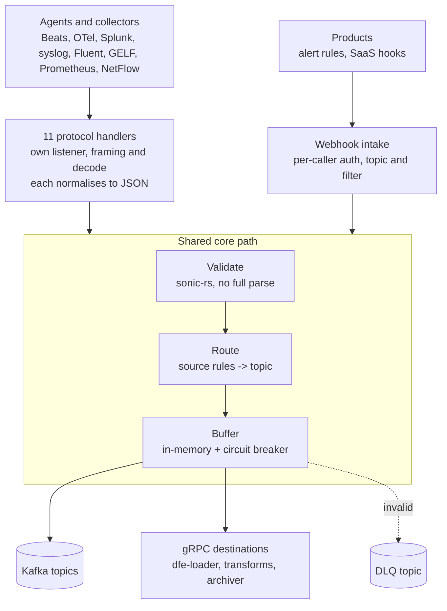

# dfe-receiver architecture

Why the service is shaped the way it is, and the rules you cannot read off the
code. The configuration reference is [config.example.yaml](../config.example.yaml);
the component-by-component detail is in [DESIGN.md](DESIGN.md).

## The problem

Agents do not speak one protocol. A site already running Filebeat, an
OpenTelemetry collector, rsyslog, a Splunk forwarder and a Prometheus server has
five wire formats on the floor and no appetite for changing any of them. The DFE
pipeline behind wants one thing: JSON on a Kafka topic.

Three ways to close that gap. Put a translator in front of each agent, and the
deployment count multiplies. Teach dfe-loader the five protocols, and
network-facing framing and decode move into the middle of the pipeline, next to
the enrichment and schema logic. Or terminate every protocol once, at the edge,
and normalise before anything else sees the data.

dfe-receiver is the third option. Everything below follows from it.

## What that makes it

The one external door. dfe-receiver and dfe-ui are the only two components in
the stack that read untrusted input -- the loader, archiver and transforms have
no listener an outsider reaches, and dfe-fetcher dials out rather than being
dialled. So a dependency advisory here is not the same finding as the identical
advisory in dfe-loader. Grade reachability first, severity second, per
`dfe-infra/docs/THREAT-MODEL.md`. The ingest edge is
`dfe-infra/docs/INGEST-EDGE.md`, which calls the receiver a
single-homed airlock: traffic from outside, produce to local Kafka, and Kafka
never faces the network.

It is not a transform stage. The receiver decides a payload is JSON, stamps
`_source` and `_timestamp_receiver`, picks a topic and hands over. Parsing,
enrichment and schema work are dfe-loader's. The one deliberate exception is
`_raw`: the receiver can retain the original wire bytes because for syslog and
friends that fidelity is gone by the time the loader sees the record.

## Shape

Eleven handlers, one core path. A handler owns its socket, its framing and its
decode, and nothing else. The moment it holds JSON bytes it calls the same
pipeline every other handler calls, so validation, routing, backpressure and
metrics exist once rather than eleven times.

`ProtocolHandler` (`src/server/traits.rs`) is where the two halves meet: `name()`, `bind_address()`, `listeners()`, `start(shutdown)`. `Server::build_handlers` (`src/server/mod.rs:125`) collects the enabled handlers, and `Server::run` spawns each one. Adding a protocol is a directory under `src/server/` plus a block in `build_handlers` -- it does not touch the core path.

`listeners()` returns one `BoundAddr` per socket the handler binds, and `/readyz` waits on all of them: it answers 503 until every enabled listener is serving, and again once any of them stops. A listener that cannot bind, or stops before shutdown, fails its handler's `start()`, the handler's other listeners stop with it, and the process logs `Protocol handler failed` and stays up. An enabled handler that cannot be built fails the same way.

HTTP is the exception to opt-in. It always runs, because `/livez` and `/readyz`
ride its listener, so exposing ingest exposes both probe paths.

The webhook intake is its own handler rather than a route on `/ingest`, for
reasons worth keeping. `/ingest` checks one server-wide credential in middleware
before the body is read, where a product is identified per caller and a signed
request needs the body to verify. A product's payload shape is its own, so
`routing.source_rules` cannot pick its topic. And an own listener lets a
deployment expose only that port to the product's egress.

## The hot path, and what it costs

PB/s-a-day throughput sets the rules for the core path. The payload stays
`bytes::Bytes` from socket to sink -- reference-counted, so a clone copies
nothing. Field extraction for routing borrows out of the payload (`Cow<str>`)
rather than building a DOM. Topic lookups use `FxHashMap`. No `format!()` on the
path.

The consequence a reader should know: validation proves the payload IS JSON and
that any required fields are present. It does not prove the payload is
well-shaped for downstream. That is deliberate -- a full parse at the door would
cost the throughput the design exists for.

## Delivery: the answer waits for the destination

A listener whose protocol carries an answer holds it until every destination confirmed the request's records: a Kafka delivery report, a gRPC destination's answer, or a dead-letter write the DLQ confirmed. That is `acknowledgements.enabled`, default on, per listener: `server`, `grpc`, `otlp`, `splunk_hec`, `lumberjack`, `fluent`, `webhook`, `prometheus_rw`. Syslog, GELF and flow have no answer to hold.

A record not confirmed within the hold gets the protocol's retryable refusal (503 with `Retry-After`, `UNAVAILABLE`, no ack), and the sender keeps it. That means "not confirmed", not "not written": a Kafka message timeout can expire while a produce request is in flight, so a resend can deliver a record twice. Duplicates, never loss.

The hold is 25 s, short of the listener's request timeout or a gRPC sender's `grpc-timeout` by a margin. OTLP HTTP exports carry no deadline, so they hold 9 s (`otlp.http_max_hold_ms`), inside the OTel exporters' 10 s default timeout. While any listener holds, the producer's `message.timeout.ms` is 20 s unless the operator set one, and a gRPC destination's send deadline is 20 s (`loader.timeout_ms` for the loader), so both settle inside the hold. Admission, the held-byte ceiling (a quarter of the memory limit per listener) and the `transport_ack_*` metrics are scalo's `Tickets`, behind the pipeline's own pressure brake and memory lease.

With `acknowledgements.enabled: false` a listener answers once the record is queued. `receiver_kafka_sends_total` is what librdkafka queued, `receiver_kafka_delivered_total` what a broker acknowledged, and `receiver_kafka_delivery_failures_total{reason}` what no broker confirmed. `pipeline_delivery_guarantee{guarantee,reason}` reports what each listener gives.

The sink builds its own `ThreadedProducer` instead of using scalo's
`KafkaProducer`, because scalo hard-codes a `ProducerContext` with no injection
point and a delivery report needs one. The cost is `producer_client_config()`
(`src/sink/kafka/mod.rs:141`), a hand copy of scalo's config assembly and its
precedence -- profile defaults, then `librdkafka_overrides`, then the sizing
surface, which wins. It goes wrong quietly if scalo reorders or adds a key.
scalo-rs#26 is the long-term fix.

No listener answers success for a record the pipeline did not take: a sender that reads a false success discards the record, and nothing downstream can recover it. A failure is final only when the record itself is at fault -- malformed, over a destination's size ceiling, or sent without valid credentials. Anything else tells the sender to retry, in its own protocol's terms, and a batch stops at the first record not taken. The sender resends the whole request, so the records taken before it arrive twice: duplicates, never loss. Each listener's answer, and the protocol rule behind it, is in [DESIGN.md](DESIGN.md#what-a-sender-is-told).

## Buffering: only for answers given at enqueue

A held answer sends straight to the destination's sink: the sender still has the record, so nothing buffers or spools it. A buffer, and its spool, are built only when some enabled listener answers at enqueue -- one with `acknowledgements.enabled: false`, or syslog, GELF or flow. With every listener holding, `buffer.spillover.enabled` opens no spool.

For answers given at enqueue, the default backend is an in-memory buffer behind a circuit breaker, with no disk involved. For the Kubernetes deployment that is the right trade -- OOMKill plus KEDA answers a backlog by adding pods, and a spool on an ephemeral volume buys little. The buffer counts as healthy only while its sink is healthy and it has room, so a broker refusing every record stops admission rather than letting the queue hide it.

Disk spillover exists for deployments that want crash-resilient buffering or run outside Kubernetes. `buffer.spillover.enabled` swaps the backend for scalo's `TieredSink` with a disk spool, one directory per sink under `buffer.spillover.path`: `kafka/` for the bus and `grpc/<name>/` for each gRPC destination. Two sinks cannot share a spool. `SinkBackend` (`src/buffer/mod.rs`) is the enum holding one or the other. Either way the shutdown drains into the sink and then flushes it.

A buffered record a destination refuses for good leaves once the DLQ confirms the write. While the DLQ refuses, it stays at the front and holds up the records behind it: its sender was answered at enqueue, so dropping it would be loss.

## Configuration

A cascade, scalo's: compiled defaults, then `/etc/dfe-receiver/config.yaml`,
then `./config.yaml`, then `~/.config/dfe-receiver/config.yaml`, then
`DFE_RECEIVER_*` environment variables, then CLI arguments, then runtime
overrides. Routing, validation and enrichment reload on SIGHUP.

Secrets are never literals in the config file. Every credential is a
`provider:path[:key]` reference -- `file:`, `vault:`, `env:` -- resolved through
`scalo::secrets::resolve`. The receiver has no resolver of its own, and that is
deliberate: an `aws:` reference is refused at startup naming the scalo feature it
would need, rather than pulling the AWS SDK in for a path nothing uses.

## Invariants

The rules a reader cannot infer, in rough order of how much damage getting them
wrong does.

1. **An answer given at enqueue is not a delivery receipt.** With
   `acknowledgements.enabled: false` the client has been answered by the time a
   broker sees the record, and a kill loses what the producer and the buffer
   held. The default holds the answer until the destination confirmed it; a
   change that answers earlier, or buffers a held record, gives that away.

2. **`chart/` and `Dockerfile` are generated, not written.** Both come from the
   deployment contract in `src/deployment.rs`, and two unit tests assert the
   committed files still match the generator. A hand edit is reverted the next
   time anything regenerates. Regenerate with `dfe-receiver --emit-helm chart`
   and `dfe-receiver --emit-dockerfile Dockerfile`. A scalo bump can change the
   generator, so a scalo bump without a regenerate fails this repo's own suite --
   that is the guard working, not a spurious failure.

3. **`chart/` is not the chart that deploys this service.** It is the standalone
   artefact. The suite deploys the receiver from dfe-infra's own chart, which
   pins the built image.

4. **dfe-engine hand-mirrors `Config::validate()`.** The copy lives at
   `dfe-engine/src/dfe_engine/services/plugins_builtin/receiver.py` and no script
   compares the two. They have already drifted both ways: the engine refuses a
   config where gRPC and HTTP share a `bind_address`, which this repo does not
   check anywhere, and this repo has since grown destination, webhook,
   rate-limit and spillover rules the engine copy has never heard of. A
   validation change here is only half the change.

5. **`auth.mode` defaults to `none`.** A deployment that has not configured auth
   accepts unauthenticated posts. Body size, request timeout, the IP filter and
   the rate limiter are the only other limits, and a default deploy is
   internet-facing with an empty `loadBalancerSourceRanges`, which means every
   address on earth. The receiver is built to sit behind edge protection, never
   directly on the internet.

6. **`_raw` holds the payload before redaction.** Anything stripped from the
   parsed fields downstream is still in `_raw`, indexed for full-text search.
   Capture is off by default for that reason as much as for the doubled bytes.

7. **`Config::validate()` only runs on the cascade path.** A test that builds a
   `Config` struct directly never reaches it, which is how the brokerless test
   configurations work. Do not read a passing test as proof that a YAML file
   would be accepted.
